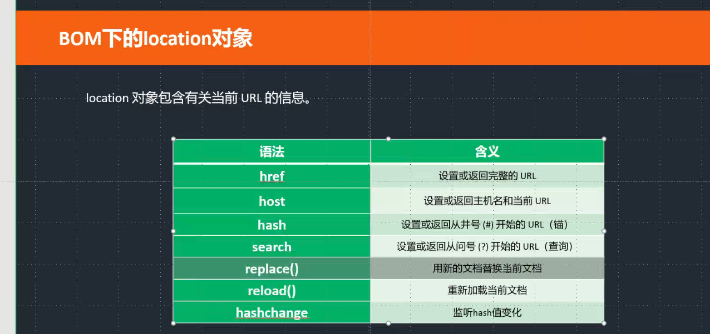

# BOM

### navigator : 浏览器信息对象
```javascript
console.log( navigator.language );              //浏览器当前语言
console.log( navigator.cookieEnabled );         //是否开启cookie功能              cookie是很有用的，跟踪用户身份
console.log( navigator.onLine );                //是否有网
console.log( navigator.plugins );               // 浏览器的插件集合信息

这个是必须要掌握
console.log( navigator.userAgent );             //浏览器详细信息


if(/* 判断是mobile */ navigator.userAgent.includes('Mobile') ){
    专门针对手机端做一些处理。
    console.log('1');
}
else{
    PC端进行处理
    console.log(2);
}
````


### location 对象包含有关当前 URL 的信息

```javascript
一个网页可以在本地打开，也可以在服务器上打开。
    xxx: -> 协议 
    本地打开 : file:  
    服务器打开：http:  https:

console.log( location );   返回一个url对象

    url对象:

    {
        protocol : 'file:'                  -> 协议
        hostname : 'www.baidu.com'          -> 域名
        search : ''                          -> 返回url问号后面的内容
        hash : ''                            -> 返回url井号后面的内容
        href : ''                        -> 返回当前整体的url
    } 

setTimeout(function(){
    location.reload();                             //  刷新当前页面
    location.href = "https:www.baidu.com";          //跳转到百度
    location.replace("https:www.baidu.com");        //替换url
},3000);


document.onclick = function(){
    location.href = location.href + '#11111'
};


hash值一旦变化的就会触发这个事件，并且产生历史记录
 window.onhashchange = function(){                // 监听hash值变化的
    console.log(123);
}; 
```


---
```javascript
buttons[0].onclick = function(){

    history.forward();            //可以控制历史记录向前
    history.go(1);

};
buttons[1].onclick = function(){

    history.back();                  //可以控制历史记录向后
    history.go(-1);

    >>条件：需要服务器环境才可以。
    history.pushState('hello','' , './aaaa.html');          // 可以给浏览器添加一条历史记录进去

};

window.onpopstate = function(ev){                           //可以拿到pushState添加进去的数据
    console.log( ev.state );
};


console.log( screen.availWidth );    // 电脑屏幕的分辨率

```