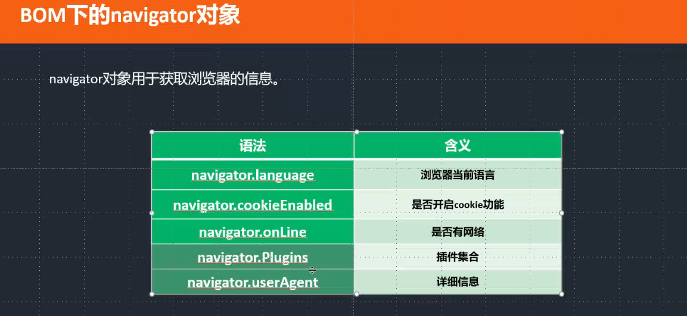
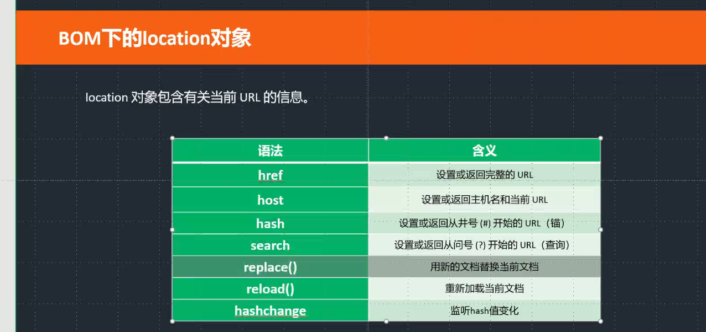

# 函数
 ```javascript
 function foo(number){       // 形式参数->形参  （ 过程： 形式参数 = 实际参数）
    console.log(number);
}

foo(123);        // 实际参数->实参 
```

##### arguments : 实参的集合
```javascript
        function foo(){
            console.log( arguments );
            console.log( arguments.length );            集合的长度  5
            console.log( arguments[0] );                集合中的第一个元素 , 下标是从0开始的

            var result = 0;
            for(var i=0;i<arguments.length;i++){
                i : 0 1 2 3 4
                result += arguments[i];
            }
            console.log(result);
        }
        foo(1,2,3,4,5)
```
---
---
# 四种操作属性的方式：
    1. 点                      ✔
    2. []                      ✔  优势：适合把属性做成变量对待的时候
    3. getAttribute()          ✔  可以获取自定义属性 ( 以前的方式 )
    4. data-*                  ✔ H5新提供的，获取自定义属性 ( 推荐的方式 )

####   
> console.log( elem['title'] );
> elem['title'] = 'haha';

```javascript
    elem.style.background = 'red';
    elem['style']['background'] = 'red';

    css('color' , 'blue');
    function css(attr , value){
        elem.style[attr] = 'blue';
    }
```

      也可以获取自定义属性
      var elem = document.getElementById('elem');
      console.log( elem['qianfeng'] );
    
      console.log(   elem.getAttribute('qianfeng')   );
      elem.setAttribute('qianfeng','新的值');

      console.log( elem.dataset.qianfeng );
      elem.dataset.qianfeng = '新的值';


   ##### 点 或者 [] 虽然不能直接通过标签添加属性和获取属性，但是在JS中可以添加属性以及获取属性。
   > elem.qianfeng = '千锋';
   > console.log( elem.qianfeng );
---
---
# this详解

#### this : 表示当前执行代码的环境对象 ， 在函数内部，this的值取决于函数被调用的方式。

    * 注:
        + 在函数内部进行使用this操作
        + 取决于函数被调用的方式
        + 当有多个嵌套函数的时候，this只跟最近的当前函数有关系

```javascript
    function foo(){
        console.log(this);  //不知道
    }
```

```javascript
    function foo(){
        console.log(this); 
    }
    foo();  //在调用的时候，我就知道this是谁了？当函数名前面没有任何代码的时候，this就是window

    123.foo();      this :123
    elem.foo();     this:elem
    'hello'.foo();  this:hello

```

```javascript
    var elem = document.getElementById('elem')      
    elem.onclick = function(){       //点击elem的时候 -> elem.onclick();
        console.log(this);
    };
```

```javascript
    var elem = document.getElementById('elem');
    elem.onclick = function(){
        foo();
    };
    function foo(){
        this.style.backgroun'red';      // window
    }

```
            
```javascript
var elem = document.getElementById('elem');
elem.onclick = foo;
function foo(){
    this.style.background = 'red';          // elem
}
```
            
```javascript
var obj = {
    username : 'xiaoming',
    showName : function(){
        console.log( this.username );
    }
};
obj.showName();

function foo( fn ){            // fn = obj.showName
    fn();                     // fn前面没有东西，那么函数中this就是window
}
foo( obj.showName );
```

#### call()、apply()、bind()  : 能够改变this指向的方法  
> ##### 1. call的第一个参数是函数this指向 ，call方法从第二个参数开始就是函数的实参  
> ##### 2. apply的第一个参数是函数this指向 , apply方法只有两个参数 ，第二个参数类似于数组或数组 elems arguments  
> ##### 3. call的第一个参数是函数this指向 ，call方法从第二个参数开始就是函数的实参  


```javascript
 function foo( num , num2 ){
    console.log(this);
}
//foo();
foo.call( document , 5 , 6);         

foo.apply( document , [ 5 , 6 ] );      
            
foo.bind( document );    // bind并不会调用这个函数，只会改指向

    //foo.bind( document , 5 , 6 )();   // bind如何执行
    //foo.bind( document )( 5 , 6 );   // bind如何执行
    //foo.bind( document , 5 )( 6 );   // bind如何执行

    //call()
    var elem = document.getElementById('elem');
    elem.onclick = foo.call(document);
    function foo(){
        console.log(this);
    }
    
    //call()
    elem.onclick = function(){
        foo.call(document);
    };
    function foo(){
        console.log(this);
    }
    
    //bind()
    elem.onbindclick = foo.(document);     //bind的场景，很方便，不用像call一样包上一层函数
    function foo(){
        console.log(this);
    }
```
---
---
# 操作元素

>设置样式：  elem.style.width = '400px';

```javascript
console.log( elem.style.width );  //行内样式 ,只能找到style属性中的样式

console.log(  getComputedStyle(elem).width   );   //获取操作：最终样式      
```     
---
---
# 字符串

#### 字符串，不是对象，字符串不能添加属性和方法，但是并不代表字符串没有属性和方法。

> var str = 'hello';
##### 1. str.length:字符串的长度
> console.log( str.length );   
> console.log( str[1] );    这种方式也支持，但是不推荐使用（性能不高）

##### 2. str.charAt(): 找到指定位置的字符，是推荐的写法（性能高）
##### 3. str.charCodeAt():  找到指定字符对应的unicode编码
##### 4. 截取字符串：substring()、slice() 、substr()

```javascript
var str = 'hello world!!!';

console.log(  str.substring(1,3)  ); //两个参数 : 起始位置，结束位置（不包含结束位置）

console.log(  str.substring(1)  );  //只写一个参数：截取的部分是从起始位置一直到字符串的结束
    
console.log( str.slice(1,3) );  //两个参数 : 起始位置，结束位置（不包含结束位置）

**区别：
    1. 顺序的问题。
        console.log(  str.substring(3 , 1)  );       //两个参数的顺序无所谓的
        console.log( str.slice(3,1) );               //X  两个参数有顺序问题。
    2. 是否可以写负数
        console.log(  str.substring(-1 , -4)  );    //不支持负数写法的
        console.log(  str.slice(-4 , -1)  );        //d!!
  
console.log( str.substr(1,3) );   //两个参数：起始位置、截取的个数
``` 
##### 5. 找指定字符的位置：  indexOf() ,  lastIndexOf()   -----> 从前往后
```javascript
var str = 'hello weorld!!!';   
console.log( str.indexOf('e' , 2) ); //两个参数：第一个参数指定的字符串，第二个参数：找字符的起始位置(默认0)


//找每一个e的位置
var str = 'hello weorld!!!hello weorld!!!hello weorld!!!hello weorld!!!';
var value = 'e';
for(var i=0;i<str.length;i++){
    if( str.charAt(i) == value ){
        console.log( str.indexOf(value , i) );  //找每一个e的位置
        console.log( i );
    }
} 


//lastIndexOf()
var str = 'hello weorld!!!';
console.log( str.lastIndexOf('e',5) );  //从5的位置开始往前查找(默认位置在最后)


var str = 'hello weorld!!!';
console.log( str.indexOf('ed') );  //多个字符串找位置的时候返回的第一个字符的位置

>>注：一旦没有匹配到，就会返回 -1

var str = 'hello weorld!!!';
var now = 'el';
if( str.indexOf(now) > -1 ){
    console.log('有这个字符');
}
else{
    console.log('没有这个字符');
} 

``` 
##### 6. 查看字符是否存在：includes()、startsWith()、endsWith()

```javascript
var str = 'hello weorld!!!';
var now = '!';
    
console.log( str.includes(now) );  //查看指定的字符串是否被字符串所包含，返回一个布尔值

if( str.includes(now) ){
    console.log('有这个字符');
}
else{
    console.log('没有这个字符');
} 


startsWith()、endsWith() : 判断是否在起始位置和结束位置（返回布尔值）
console.log( str.endsWith(now) );
``` 
##### 7. 去掉字符的前后空格：trim()、trimLeft()、trimRight()
> var str = '   he  llo    ';
>console.log(  '(' + str.trimLeft() + ')' );

##### 8.    字符串转大小写： toUpperCase()、 toLowerCase()

```javascript
var str = 'Hello';
console.log( str.toUpperCase() );  //转大写
console.log( str.toLowerCase() );  //转小写

``` 
##### 9. 分割字符串成数组：split() , 参数就是分隔符

```javascript
var str = 'a+b+c+d';
console.log( str.split('w') );  // ["a+b+c+d"]
console.log( str.split('') );   //["a", "+", "b", "+", "c", "+", "d"]   
``` 
---
---
# 数组
#### 数组是相同数据类型的元素按一定顺序排列的集合。

```javascript
var arr = [1,2,3];
console.log( arr.length );  //数组的长度  3
console.log(  arr[1]  );    //2

var arr = ['a','b','c','d'];
for(var i=0;i<arr.length;i++){
    console.log( arr[i] );
} 
``` 
##### 元素集合  arguments 类数组（伪数组），没有数组方法的。


数组写法的扩展:

```javascript
var arr = [];    ==    var arr = new Array();
var arr = new Array();
var arr = [];      //数组的类型：对象
console.log( arr.myColor );
arr.myColor = 'red';

var arr = new Array(3);     //诡异的一个值 [,,] , 建议大家创建数组都用 []
console.log( arr );
``` 
    

多维数组:
```javascript
var arr = [     ['a','b'] , ['c','d']    ];
console.log(  arr[1][0]  );     //[1]外面的数组 [0]里面的数组

var arr = ['a','b'];  
arr[1] = 'c';           //可以直接进行赋值操作的
arr[3] = 'c';   //['a','b','c']
console.log( arr );

arr.length = 0;    //快速的清空一个数组
arr.length = 10;
console.log(arr);

**总结：长度和下标不仅可以获取也可以设置
```

#### 数组是有方法:

##### 1. unshift():添加到起始位置
```javascript
var arr = ['a','b','c','d'];
var a = arr.unshift('e','f');  往数组的起始添加子项
``` 
##### 2. push():添加到结束位置
```javascript
var arr = ['a','b','c','d'];
arr.push('e');      //就是往数组的最后添加子项
console.log( arr );    ['a','b','c','d','e'];
``` 

```javascript
var arr = ['a','b','c','d'];
var a = arr.push('e','f');      就是往数组的最后添加子项
console.log( arr );    ['a','b','c','d','e'];
console.log( a );       push()执行完的结果，会返回数组的长度
注：会改变原数组 ( 变异数组方法 )
``` 
##### 3. shift():删除起始位置
```javascript
var arr = ['a','b','c','d'];
var a = arr.shift();    //不写参数 , 从数组起始删除一项
``` 
##### 4. pop():删除结束位置
```javascript
var arr = ['a','b','c','d'];
var a = arr.pop();      不写参数 , 从数组最后删除一项
console.log( arr );
console.log( a );       pop()执行完的结果，返回删除的那一项
``` 

```javascript

``` 


##### 5. 截取数组 : slice() : 不会改变原数组的
```javascript    
var arr = ['a','b','c','d'];    
var a = arr.slice( 1 , 3 );     //起始位置和结束位置（不包含结束位置）
```    

##### 6.合并数组成字符串：join() , 参数就是用什么字符去连接成字符串
```javascript
var arr = ['a','b','c','d'];
console.log( arr.join('') );  //abcd
console.log( arr.join() );  //a,b,c,d , join()默认就是用逗号连接
```


##### 7.splice()  删除或添加或替换现有子项 ::::会改变原数组（变异方法）
        
>splice()执行的返回结果：被删除元素，并且得到一个数组
>push() ,unshift(), pop() ,shift() : 只能操作起始和结束


第一个参数：起始位置 ， 第二个参数：删除的个数
>var arr = ['a','b','c','d'];
>var a = arr.splice( 1 , 2 );

第三个参数开始，就是添加的子项（位置是起始位置的前面）
```javascript
var arr = ['a','b','c','d'];
arr.splice( 1 , 0 , 'e','f');
console.log( arr );    //["a", "e", "f", "b", "c", "d"]
```

##### 8.合并多个数组为一个数组：concat()
```javascript
var a = ['a','b'];
var b = ['c','d'];
var c = ['e'];

console.log(  a.concat(b , c)  );
console.log(  a.concat('hello')  );   //其他类型的子项也可以合并到数组里
```

##### 9. 查找数组子项的位置：indexOf()、lastIndexOf()
```javascript
var arr = ['a','b','c','d'];
console.log( arr.indexOf('b') );  // 1
console.log( arr.indexOf('w') );   //-1
console.log( arr.includes('c') );   // 布尔值，是否包含
```


##### 10. 数组反转： reverse()

     var arr = ['a','b','c','d'];
     var a = arr.reverse();
     console.log( arr );   //变异方法  ["d", "c", "b", "a"]
     console.log( a );   //结果就是反转的数组  ["d", "c", "b", "a"]

##### 11.排序 : sort()
```javascript
var arr = [4,2,8,1,12,34,2];
var a = arr.sort();
console.log( arr );    //变异方法 , 默认从小到大 , 按位一位一位的比较  [1, 12, 2, 2, 34, 4, 8]
console.log( a );    //结果就是排序后的数组   [1, 12, 2, 2, 34, 4, 8]
```
>sort() : 自定义排序方式 ---- 通过给sort添加一个函数作为参数来实现自定义排序规则
>> 函数中的两个参数：n1,n2 表示:
        >>> 数组中的任意两个值
        >>> 当函数返回负值，两个值的位置不变
        >>> 当函数返回正值，两个值的位置切换
        
```javascript
var arr = [4,2,8,1,12,34,2];
arr.sort(function(n1,n2){

// if( n1 > n2 ){
// return -100000;
// }
// else if(n1 < n2){
// return 10000;
// }
// else{
// return 0;
// }
return n1 - n2;
});
console.log( arr ); //[1, 2, 2, 4, 8, 12, 34]


// 按字符串长度排序
var arr = ['red','yellow','blue','green','black','white'];
arr.sort(function(n1,n2){
    return n1.length - n2.length;
});
console.log( arr ); // ["red", "blue", "green", "black", "white", "yellow"]
```

##### 12. map()：返回一个新数组，数组中的元素为原始数组元素调用函数处理后的值。
>map() : 是不能改变原数组的，回调函数可能被调用多次。
>注：map()主要目的是映射一个新数组出来

```javascript        
var arr = [1,2,3,4];
var newArr = arr.map(function(v,i,a){
    // v: 1 , 2, 3, 4 每一项
    // i: 0 1 2 3 下标
    // a :整体数组
    return i - 1;
})


var newArr2 = arr.map(function(v,i,a){
    return v ** 2;      //的2次方
});

console.log( newArr );    //[-1, 0, 1, 2]
console.log( newArr2 );    //[1, 4, 9, 16]
```


##### 13.filter()：检测数值元素，并返回符合条件所有元素的数组。
> 注：得到一个过滤后的数组
```javascript 
var arr = [1,2,3,5,6,7,4,1,2,5,7,8];
var newArr = arr.filter(function(v,i,a){
    //return v > 4;    //一旦条件为真，就会得到对应的子项，为假就过滤掉这个子项
    return v % 2 == 0;
});
console.log( newArr );  //[2, 6, 4, 2, 8]
```
    

##### 14. find()：返回通过测试（函数内判断）数组的第一个元素的值
> 注：只会返回一个值，就是第一个满足条件的

```javascript 
var arr = [1,2,3,5,6,7,4,1,2,5,7,8];
var findValue = arr.find(function(v,i,a){
    return v > 4;  
});
console.log( findValue );   //5
```


##### 15. forEach()：数组每个元素都执行一次回调函数。 
> 注：跟循环功能类似（区别：它只能给数组用，伪数组不能用）

    var arr = ['a','b','c','d'];
    arr.forEach(function(v,i,a){
        console.log(v);
    });


##### 16. reduce()：将数组元素计算为一个值（从左到右）
> 注：结果就是一个值（就是把数组的每一项合到一起）
>>reduceRight()：将数组元素计算为一个值（从右到左）
```javascript 
var arr = [1,2,3,4,5];
var newValue = arr.reduce(function(n1,n2){
    // 第一次的时候：n1 -> 1 n2 -> 2
    // 第二次的时候：n1 -> return上一次的值 n2 -> 3
    return n1 - n2;
});
console.log( newValue );   //-13


var newValue2 = arr.reduceRight(function(n1,n2){
    // 第一次的时候：n1 -> 5 n2 -> 4
    // 第二次的时候：n1 -> return上一次的值 n2 -> 3
    return n1 - n2;
});
console.log( newValue2 );   //-5
```    


##### 17. every()：检测数值元素的每个元素是否都符合条件。
> 注：结果是一个布尔值 , 都满足就是真，有一个不满足就是假

##### 18. some()： 检测数组元素中是否有元素符合指定条件。
> 注：结果是一个布尔值 , 有一个满足条件就是真，除非都不满足条件就是假
       

    var arr = [6,10,4,7];
    var isBol = arr.some(function(v,i,a){
        return v > 100;
    });     
    console.log(isBol);
---
---
# DOM

##### DOM : 就是JS去操作HTML。

    getElementsByTagName()    querySelector()     innerHTML  -> DOM操作
    document (文档) , DOM就是把文档看成一个对象


##### document找元素的简写操作:
```javascript
document.body              -> <body>
document.doctype           -> <!DOCTYPE html>
document.documentElement    -> <html>
document.head               -> <head>
document.title             -> <title>
```

#####DOM树：就是把页面的所有节点形成一个树形结构。          
> 如何获取节点的类型？nodeType   
>>文档节点（document）
>>元素节点（element）
...
> console.log( document.nodeType );               // 9 --->文档节点
> console.log( document.body.nodeType );          //1 --->元素节点
> console.log( document.doctype.nodeType );       //10 --->文档类型节点
> console.log( elem.attributes[0].nodeType );     //2 --->属性节点


##### elem.childNodes : elem元素下面的所有子节点

        elem.childNodes.length  子节点长度

        console.log( elem.childNodes[0].nodeType );   8 注释节点
        console.log( elem.childNodes[1].nodeType );   3 文本节点
        console.log( elem.childNodes[2].nodeType );   1 元素节点
        

```javascript
var ul = document.getElementsByTagName('ul')[0];
ul.childNodes.length
    注：空格属于文本节点（空白节点）
    childNodes : 会获取所有类型的子节点
    children : 会获取所有元素类型的子节点

for(var i=0;i<ul.childNodes.length;i++){
    if( ul.childNodes[i].nodeType == 1 ){
        ul.childNodes[i].style.background = 'red';
    }
}  


for(var i=0;i<ul.children.length;i++){
    ul.children[i].style.background = 'red';
} 
```


> parentNode (父节点-----所有类型)   
> parentElement   (父节点-----元素类型) 
> offsetParent   (有定位模式的祖先节点) 

       
        console.log( document.documentElement.parentNode );  document 9
        console.log( document.documentElement.parentElement );  null
        
        console.log( document.parentNode );   null
        console.log( elem.offsetParent );    找有定位模式的祖先节点 body最外层的祖先 , 跟CSS中的绝对定位查找是一样的。
      


-  - - 

##### 元素大小 ,  对隐藏的元素是获取不到大小的
```javascript
>>>clientWidth ,clientHeight

elem.clientWidth               //content + padding
offsetWidth offsetHeight 
elem.offsetWidth               //content + padding + border

elem.getBoundingClientRect().width  //      content + padding + border
```
---------------------------------------------------------------
##### 可视区大小
```javascript
>>window.innerWidth（Height）

console.log( window.innerWidth );                  //包含滚动条
document.documentElement.clientWidth（Height）
console.log( document.documentElement.clientWidth );  //不包含滚动条

```

-------


##### 元素位置 : offsetLeft  offsetTop        -> 元素到页面的距离
```javascript    
offsetLeft : 到有定位模式的祖先节点，如果祖先节点都没有定位模式就到页面。

getBoundingClientRect() : 返回一个元素的信息，包含 left top rigth bottom width height  ->  left top 是到浏览器可视区的距离

var elem2 = document.querySelector('#elem2');
console.log( elem2.getBoundingClientRect().right );


var elem = document.querySelector('#elem');
console.log( elem.offsetTop );
        ||
console.log( elem.getBoundingClientRect().top + window.pageYOffset );

```
---------

##### 滚动距离：

```javascript
>>window.XOffpageset（pageYOffset）  W3C比较推荐的使用

document -> 文档 -> 作为页面最外层的对象。(DOM的老大)
window -> 是document的外层（document的老大）

document.onclick = function(){
    console.log( window.pageYOffset );   获取是没问题的
    window.pageYOffset = 300;           不能进行设置
};


>>document.documentElement.scrollLeft（Top）

document.onclick = function(){
    console.log( document.documentElement.scrollTop ); 获取是没问题的
    document.documentElement.scrollTop = 300;           可以设置
};


// 让滚动条带有动画
window.scrollTo({ top: divs[this.index].offsetTop, behavior: "smooth" });


滚动的宽高： scrollWidth （ Height ）

可以获取整个页面的宽高

    document.body.scrollHeight 
    document.body.offsetWidth（Height）
           
```
---
---
# BOM

### navigator : 浏览器信息对象
```javascript
console.log( navigator.language );              //浏览器当前语言
console.log( navigator.cookieEnabled );         //是否开启cookie功能              cookie是很有用的，跟踪用户身份
console.log( navigator.onLine );                //是否有网
console.log( navigator.plugins );               // 浏览器的插件集合信息

这个是必须要掌握
console.log( navigator.userAgent );             //浏览器详细信息


if(/* 判断是mobile */ navigator.userAgent.includes('Mobile') ){
    专门针对手机端做一些处理。
    console.log('1');
}
else{
    PC端进行处理
    console.log(2);
}
````


### location 对象包含有关当前 URL 的信息

```javascript
一个网页可以在本地打开，也可以在服务器上打开。
    xxx: -> 协议 
    本地打开 : file:  
    服务器打开：http:  https:

console.log( location );   返回一个url对象

    url对象:

    {
        protocol : 'file:'                  -> 协议
        hostname : 'www.baidu.com'          -> 域名
        search : ''                          -> 返回url问号后面的内容
        hash : ''                            -> 返回url井号后面的内容
        href : ''                        -> 返回当前整体的url
    } 

setTimeout(function(){
    location.reload();                             //  刷新当前页面
    location.href = "https:www.baidu.com";          //跳转到百度
    location.replace("https:www.baidu.com");        //替换url
},3000);


document.onclick = function(){
    location.href = location.href + '#11111'
};


hash值一旦变化的就会触发这个事件，并且产生历史记录
 window.onhashchange = function(){                // 监听hash值变化的
    console.log(123);
}; 
```


---
```javascript
buttons[0].onclick = function(){

    history.forward();            //可以控制历史记录向前
    history.go(1);

};
buttons[1].onclick = function(){

    history.back();                  //可以控制历史记录向后
    history.go(-1);

    >>条件：需要服务器环境才可以。
    history.pushState('hello','' , './aaaa.html');          // 可以给浏览器添加一条历史记录进去

};

window.onpopstate = function(ev){                           //可以拿到pushState添加进去的数据
    console.log( ev.state );
};


console.log( screen.availWidth );    // 电脑屏幕的分辨率

```
---
---
# 对象

##### 对象是一种数据类型，可以添加属性和方法的就是对象。
    
    var obj = {};               //空对象
    console.log( typeof obj );  //object
```javascript
var obj = {
    username : 'xiaoming',   //添加一个对象的属性(属性类似于变量)
    age : 20,
    gender : 'man',
    showName : function(){   //添加一个对象的方法(方法类似于函数)
        console.log(123);
    }
};
console.log( obj.username );
obj.showName(); 


var obj = {};
obj.username = 'xiaoming';
console.log( obj.username );
obj.showName = function(){
    console.log(123);
};
obj.showName();


//错误写法示例
var obj = 'hello';   //因为这个是字符串类型，不是对象类型，所以添加属性肯定添加不上
obj.username = 'xiaoming';
console.log( obj.username );  // undefined


var obj = null;
obj.username = 'xiaoming';
console.log( obj.username );


>>>我们通过JS获取到的元素，类型都是对象，所以元素跟对象没有区别。

    var elem = document.getElementById('elem');
    console.log( typeof elem );  // object


>>对对象中没有length时候，还要进行循环 -> for in
var obj = {
    username : 'xiaoming',  
    age : 20,
    gender : 'man'
};

for( var attr in obj ){
    //console.log( attr );     // 对象中的key值
    console.log( obj[attr] );   // 对象中的value值
} 


var obj = {
    width : '200px',
    height : '100px',
    background : 'red'
};
var elem = document.querySelector('#elem');
for(var attr in obj){
    elem.style[attr] = obj[attr];
}

```
---
---
    
   # 事件
##### onclick:点击事件
```js
elem.onclick = function(){  //添加一个点击事件(等号后面接的函数叫做事件函数)
    console.log(123);
};
当我们去点击div的时候去调用 ->  elem.onclick();
```
##### ondblclick:双击事件
```js
elem.ondblclick = function(){    //双击666，双击事件
    console.log(123);
};
```
##### onmouseover:鼠标移入事件
```js
elem.onmouseover = function(){    //鼠标移入事件
    console.log(123);
};
```
##### onmouseout:鼠标移开事件
```js
elem.onmouseout = function(){    //鼠标移开事件
    console.log(456);
};
```

区别：
>       触发顺序：down > up > click
>       click 除了鼠标能触发，键盘也能触发(能够获取焦点的元素，通过回车键触发)
##### onmousedown:鼠标按下事件
```js
elem.onmousedown = function(){    //鼠标按下事件
    console.log(123);
};
```
##### onmouseup:鼠标抬起事件
```js
elem.onmouseup = function(){    //鼠标抬起事件
    console.log(456);
}; 
 ```
----
##### onfocus:获取焦点触发的事
```js
input.onfocus = function(){            //获取焦点触发的事件       onfocus
    this.style.background = 'red';
};
```
##### onblur:失去焦点触发的事件
```js
input.onblur = function(){          //失去焦点触发的事件        onblur
    this.style.background = '';
};
```

##### onresize:浏览器尺寸改变的时候会触发
```js
window.onresize = function(){               //浏览器尺寸改变的时候会触发
    console.log(123);   
}
```

##### oninput:值发生变化时触发（连续）
```js  
input.oninput = function(){  //值发生变化时触发（连续）
    console.log(123);
};
```
##### onchange:值发生变化时触发（失去焦点）
```js
input.onchange = function(){  //值发生变化时触发（失去焦点）
    console.log(123);
};
```
------

##### onload:等整个页面加载完毕触发的事件
```js
window.onload = function(){  };            // 等整个页面加载完毕触发的事件
```                
            
##### onunload:等页面关闭的时候触发
```js
window.onunload = function(){ };           //等页面关闭的时候触发
```               

##### DOMContentLoaded : 也是一个事件 , 标准的事件绑定写法才能触发，这个事件是等DOM加载完就会触发，要比onload先执行。
```js
document.addEventListener('DOMContentLoaded',function(){
    var img = document.querySelector('img');
    console.log( img.width );
}); 
```           
##### onselect:选中文本的时候会触发
```js         
input.onselect = function(){                //选中文本的时候会触发
    console.log(123);
}; 
```
            
##### onreset:在表单中，点击重置按钮触发
```js          
form.onreset = function(){   //在表单中，点击重置按钮触发
    console.log(123);
};
```


##### onsubmit:在表单中，点击提交按钮触发
```js
form.onsubmit = function(){     //在表单中，点击提交按钮触发 
    console.log(456);
        表单的验证处理
    if(input.value){
        return true;
    }
    else{
        alert('用户名不能为空');
        return false;    阻止表单提交
    }
};
```


-------
### event对象
##### event对象：事件中很重要的内容。事件发生以后，会产生一个事件对象，作为参数传给监听函数，可以操作事件的细节部分。

    
>            elem.onclick = function(ev){                    //event对象是可以操作事件细节部分的。它就是函数的第一个形参( 函数是跟事件关联的那个 )           
>               ev : 类型是对象
>               鼠标坐标，鼠标当前位置到页面的距离 pageX / pageY
>               console.log( ev.pageX );             
            

            
            
>            鼠标坐标只能获取，不能设置。
            

>            鼠标坐标：ev.clientX   ev.clientY
>                区别：ev.clientX ev.clientY          -> 可视区的坐标
>                    ev.pageX ev.pageY               -> 到页面的坐标


##### 事件流：就是事件传播的方式。
            //三个阶段：先捕获、再目标、最后是冒泡

            ev.stopPropagation();           //阻止冒泡（event对象下的）


----------
##### 事件绑定

>    elem.onclick , elem.onmouseover :       普通事件  非标准
>    elem.addEventListener() :               绑定事件  标准  -> W3C推荐
    >>    区别：
        >>>    1. 事件 一个加on ， 另一个不加on
        >>>    2. 同样的事件，普通的会覆盖；绑定的不会覆盖，都会执行
        >>>    3. 事件流：普通事件是没有捕获阶段的，绑定是有捕获阶段的
        >>>        注：事件流是由addEventListener的第三个参数决定的，默认是false(冒泡)可选的true(捕获)

```js   
elem.addEventListener('click',function(ev){
    console.log(123);
}); 
```


```js
elem.onclick = function(){
    console.log(123);
    elem.onclick = null;            //普通事件的取消写法
};
```

```js
elem.addEventListener('click',change);
function change(){
    console.log(123);
    //取消的时候，也要写两个参数，事件名和要取消的函数
    elem.removeEventListener('click' , change);                 //绑定事件的取消写法
}
```


------

##### 键盘事件 : 通过键盘来触发事件
```js
onkeydown : 键盘按下 , 按下不抬起，会一直触发。
onkeypress : 键盘按下（不含功能键）
onkeyup : 键盘抬起
    如果能获取焦点的元素是可以直接加键盘事件的 input
    如果不能获取焦点的元素，如div是不能添加键盘事件的。
    在页面中如果按下键盘想触发事件，document加键盘事件。


document.onkeydown = function(ev){
    console.log(ev.keyCode);               //键盘键值 unicode编码
        if( ev.keyCode == 13 ){
            console.log('回车');
        } 
    console.log( ev.key );                //直接可以找到是哪个键
    console.log( ev.repeat );             // 检测是否一直按下，返回一个布尔值
    console.log( ev.location );        // 键盘位置

    功能键 : ctrl alt shift ( 跟其他键组合使用 )
    console.log( ev.ctrlKey );
    console.log( ev.altKey );
    console.log( ev.shiftKey );
```


------
##### 阻止默认事件
```js
document.onkeydown = function(ev){
    if(ev.keyCode == 32 || ev.keyCode == 116){
        //return false;                 //可以阻止默认行为
        ev.preventDefault();            //可以阻止默认行为 , W3C推荐写法
    }
}


document.addEventListener('keydown',function(ev){
    if(ev.keyCode == 32 || ev.keyCode == 116){
        //return false;                             // 绑定事件中是不好用的
        ev.preventDefault();                        //绑定支持这种标准写法
    }
}); 
```
    
##### 电脑屏幕的分辨率   
>console.log( screen.availWidth );   

##### 鼠标滚轮事件
```js
elem.onmousewheel = function(ev){   //鼠标滚轮事件
    //console.log(ev.wheelDelta);  //检测滚动的数值，向下-120 向上120
    if(ev.wheelDelta < 0){  //下
        elem.style.height = elem.offsetHeight + 10 + 'px';
    }
    else{  //上
        elem.style.height = elem.offsetHeight - 10 + 'px';
    }
    return false;
};
```
---
---
# 正则

    正则表达式，又称规则表达式。(英语：Regular Expression，在代码中常简写为regex、regexp或RE)，计算机科学的一个概念。正则通常被用来检索、替换那些符合某个模式(规则)的文本。
    正则表达式能够让计算机读懂字符串的规则，正则表达式是操作字符串的。


##### 两种写法，也是有区别的：大部分时候都用简写，当正则内容需要传参的时候就要用new
       
    var re = /foo/;  //简写不能这样使用变量进行操作

    var re = new RegExp(foo);

---
    如何用正则去判断一类字符？  \反斜线  /斜线 
        \n : 转义字符 ，换行
        \s : 空格
        \S : 非空格
        \d : 数字
        \D : 非数字
        \w : 字符( 字母 数字 下划线 )
        \W : 非字符
        . : 任意字符


    如何让匹配的字符位数可变。-> 量词 实现的：
        + : 最少匹配一位 >=1
        *
        ?
        {}
        或 : |
        分组 : () 
        转义字符：  \s \d ...
        小括号：  () 分组  子项
        量词（大括号）：  +   {} 
        字符范围（中括号）：  [] 中括号内的字符表示一位，之间都是或的关系。
    
    量词 : 
        * :>=0  {0,}
        + :>=1  {1,}
        ? :0 1  {0,1}
        {}
 
### 方法：
    字符串.方法(正则) : match replace search split
    正则.方法(字符串) : test exec

    

##### test()方法 : 写法 -> 正则.test(字符串) ，正则去字符串中进行规则匹配，如果匹配成功返回true，如果匹配失败返回false

    var str = 'hello';
    var re = /ell/;  // 可以指定多位进行匹配
    console.log( re.test(str) ); 

##### search() : 字符串.search(正则) , 正则去字符串里进行规则匹配，匹配成功会返回匹配到的位置，匹配失败会返回-1

    var str = 'hello';
    var re = /e/;
    console.log( str.search(re)  );

    注：正则默认是区分大小写的：如何不区分大小写：正则的修饰符 -> i修饰符 （让正则不区分大小写）
        正则默认就是匹配成功之后，就不在继续向后匹配：修饰符 g -> 全局匹配(从头匹配到尾)


##### match() : 字符串.match(正则) ,  正则去字符串里进行规则匹配，返回匹配成功的字符的数组，匹配失败会返回null

    var str = 'skj123dfhs55aeifiwp78em;zlmcvzlxvdfh110';
    var re = /\d+/g;
    console.log( str.match(re) );  //  ["123", "55", "78", "110"]

##### replace() : 字符串.replace(正则 , 新的字符串) ，正则去字符串中进行匹配，把匹配到的字符替换成新的字符串。
    var str = 'abacad';
    var re = /a/g;
    var result = str.replace(re , '*');

    //replace()第一个参数是正则，第二个参数是新的字符串，或一个回调函数
                回调函数中，第一个参数就是匹配到的字符串

    text.replace(re , function($0){
         return '*'.repeat( $0.length );
    }

    border-style-width ->  borderStyleWidth  (正则去实现)

        var str = 'border-style-width';
        var re = /-([a-z])/g;
        var result = str.replace( re , function($0,$1){
            return $1.toUpperCase();
        });
        console.log( result );

-------
##### () : 分组 ，还有一个作用 -> 子项
    从左向右，第一个小括号就是第一个子项，第二个小括号就是第二个子项

    var str = 'hello world';
    var re = /(he(ll)o) (world)/g;
    console.log( str.match(re) );        //match如果全局匹配是没有子项的获取

    str.replace(re , function($0,$1,$2,$3){     //replace有没有g都不影响子项的获取
        console.log($0);
        console.log($1);
    }); 


--------------------------------------------
##### 贪婪模式和非贪婪模式
    var re = /<.+>/g;   // 贪婪模式( 一直匹配到最后 )
    var re = /<.+?>/g;   // 非贪婪模式( 匹配到一开始 )

    var str = '<div>aaaaasdsd</div><span class="box">2637364</span>';
    var re = /<.+?>/g;   // 非贪婪模式( 匹配到一开始 )
    console.log( str.match(re) );

##### 重复的子项
    \1 : 重复的第一个子项
    \2 : 重复的第二个子项

    var str = 'aabbacad';
    var re = /(\w)\1/g;
    console.log( str.match(re)  );


    var str = '<p class="box" title="sss">aaaa</p>';  
    var re = /<([a-z0-9]+)[^>]*>[^<]+<\/\1>/;
    console.log( re.test(str) );
---
---
# ES6

#### JS历史
    1995 : 艾奇 -> liveScript  -> JavaScript
    1996 : 微软 -> IE浏览器 -> JScript

    第一次浏览器大战，两强对立 ，IE95%。网景公司被美国在线收购了。
    网景浏览器的代码开源了，非盈利组织(mozlli，后续就是火狐)。

    在浏览器大战期间：JavaScript和JScript要进行规范统一。代码都提交给了一个中立的组织（ECMA）
        ECMAScript是规范       
        JS ：ECMAScript （底层的核心，语言的规范）、 DOM、BOM(还没有完全的规范化)


#### let const

    let跟var的区别：
        不具备块级作用域
	    不能重复定义
        不具备变量提升

    const : 定义常量
        常量的值不能改变(当操作对象的时候，如果整体改变是不行的，如果只改变子项是可以的)
        必须定义初始值
        规范要求命名大写

    const a = [1,2,3];   // 对象的引入( 内存堆栈，内存地址 )
    a.push(4);          //只是改变的内存中的栈中的值，没有改变内存的地址。
    a = [1,2,3,4];    //改变了对象在内存中的地址。


#### 解构赋值:简化赋值的一种手段。

        let [a,b,c] = [1,2,3];
        let { username , age } = { username : 'xiaoming' , age : 20 };

        let [ a , { age } , b ] = [ 1 , {sername : 'xiaoming' , age : 20} , 2 ]; 
    
------------------------------------
#### ... : ES6的语法 , 1. 剩余参数 (注：只能给解构中的最后一个变量进行使用)  2. 扩展运算符

        let [a,b,...c] = [1,2,3,4,5];
        console.log(a,b,c);   // c [3, 4, 5]

        剩余参数 ；除了可以在解构中进行使用，还可以在函数中进行使用
        function foo(a,b,...c){
            console.log(c);   //[3, 4, 5] 
        }
        foo(1,2,3,4,5);


##### 扩展运算符 : 剩余参数的逆运算  ...

    var a = [1,2,3];
    var b = [ 4 , 5 , ...a ];
    console.log( b );           //[4, 5, 1, 2, 3]

    var obj = { username : 'xiaoming' , age : 20 };
    var obj2 = { gender : '男' , ...obj };
    console.log( obj2 );     //{gender: "男", username: "xiaoming", age: 20}


    取一组数中的最大值
    var arr = [2,3,4,5];
    console.log( Math.max(...arr) );  //5

    2. 伪数组转数组
    function foo(){
       console.log( [...arguments].sort() );    //[1, 2, 3, 4, 5]
    }
    foo(1,3,2,4,5); 
-------------------------
##### 默认参数：解构赋值中。函数中。

    let [a,b,c=0] = [1,2,3];  //c有值的时候是那个值，没有的时候是默认值
    console.log( c );

    function foo(a,b,c=0){
        console.log(c);
    }
    foo(1,2); 

    
---------------
#### 模板字符串 : ``  反引号


    var a = 'hello';
    var str = `${a} world!!!`;
    

##### 可以很好的处理字符串折行的问题
```js
var str = ` <div>
                <span>aaaaa</span>
            </div>`; 


let sty = 'box';
let content = 'aaaaa';
let str = ` <div class="${sty}">
                <span>${content}</span>
            </div>`; 
```    
##### 支持简单的运算 : 运算符
```js
let str = ` <div>   ${ 1 + 1 }  </div>`;
let str = ` <div>   ${ true ? 1 : 2 }   </div>`;
let str = ` <div>   ${ 'hello'.substring(1,3) } </div>`;
let str = ` <div>   ${ [1,2,3].reverse() }  </div>`;


document.body.innerHTML += `
    <ul>
        ${
            [0,1,2,3,4].map(function(v){
                return `<li>${v}</li>`;
            }).join('')
        }
        <span>span</span>
    </ul>
`;
```


----------


#### 箭头函数 : 函数的一种写法，改写函数表达式的方式。
```js
function foo(){      //函数声明
}

var foo = function(){    //函数表达式
};

var foo = () => {};   //箭头函数

```
1. 带一个参： 
```js
var foo = function(x){  
};
var foo = x => {};          // 当函数只有一个形参，可以只写参数，不用加小括号 */


var foo = function(x,y){  
};
var foo = (x,y) => {};         //当函数有多个形参的时候，就必须添加小括号
```
2. 有返回值：
```js
var foo = function(x){  
    return 123;
};
var foo = x => 123;      // 如果函数中只有return语句，就可以这样简写。


var foo = function(x){  
    x += x;
    return 123;
};
var foo = x => {
    x += x;
    return 123;
};


var foo = function(x){
    return {
        username : 'xiaoming'       
    }
}; 
var foo = x => {
    return {
        username : 'xiaoming'           //return语句返回对象
    }
}; 

var foo = x => ({
    username : 'xiaoming'               //return语句返回对象
});
```
3. 事件函数：                
```js
document.onclick = function(ev){
    console.log(123);
};
document.onclick = ev => {
    console.log(123);
}; 
```
4. 定时器：
```js
setTimeout(function(){
    console.log(123);
},1000);

setTimeout(()=>{
    console.log(123);
},1000);    

```    
```js
区别：
        1. this指向问题
        2. 不可以使用arguments
        3. 不可以当作构造函数 : 面向对象相关的内容 ，构造函数就是普通的函数，不能是箭头函数 */

    
        document.onclick = function(){
            //this : document
            setTimeout(function(){
                //this : window
            },1000);

            setTimeout(()=>{            //箭头函数不会对this造成影响，this继续向外层函数进行查找
                //this : document
                console.log(this);
            },1000);
        };


        var foo = ()=>{
            console.log( arguments );           //报错
        };                                      //不可以使用arguments
        foo(1,2,3,4,5);
```
---
#### symbol : 表示独一无二的值。
        javascript的数据类型：
        基本类型：字符串、数字、布尔值 （ symbol bigint ）
        复合类型：对象（数组、时间、正则、函数）
        特殊类型：null、undefined

```javascript
    var obj = {};
    function foo(){
        //想给obj添加一个属性，这个属性可以在函数体内进行使用
        var key = 'username';
        obj[key] = '小明';
        console.log( obj[key] );
    }
    foo();

    //console.log( obj[key] );  //找不到
    console.log( obj.username );  //可以找到 
```
```javascript
    var obj = {};

    function foo(){
        //想给obj添加一个属性，这个属性可以在函数体内进行使用
        var key = Symbol();  //独一无二的值
        obj[key] = '小明';
        console.log( obj[key] );
    }
    foo(); */

    //console.log( obj[key] );  //找不到
    //console.log( obj.Symbol() );  //这个时候就真没办法在外面找到小明

```

#### bigint : 可以扩大数字的范围。
```javascript
    var n = 162738162381231231;
    console.log(n);
    console.log(++n);

    var m = 162738162381231231n;
    console.log(m);
    console.log(++m);
```

#### for of 循环
```javascript
    var arr = ['a','b','c','d'];
    for(var v of arr){
        console.log(v);  // v是数组中的每一个子项
    } 
```

```javascript
    var str = 'hello';   //数组OK的
    for(var v of str){
        console.log(v);
    } 
```

```javascript
    var lis = document.querySelectorAll('li');  //集合元素也是可以的
    for(var v of lis){
        console.log(v);
    }
```

```javascript
    var obj = { username : 'xiaoming' , age : 20 };   //对象不能用for of
    for(var v of obj){
        console.log(v);
    } 
```

```javascript
    var obj = { username : 'xiaoming' , age : 20 };
    console.log( Object.keys(obj) );  //["username", "age"]
    console.log( Object.values(obj) );  //["xiaoming", 20]
    console.log( Object.entries(obj) );  // [ ["username","xiaoming"] , ["age",20] ]

     for(var v of Object.entries(obj)){  //间接地对对象进行for of操作
        console.log( v[0] , v[1] );
    } 
```

#### Set() : 自带数据去重功能
> var s = new Set(['a','b','c']);
> console.log( s.length );  // undefined
> console.log( s.size );  //3 Set()数据类型的集合长度 size属性
> console.log( s[0] );  // undefined  不能通过下标的方式找到子项

* Set()数据结构是可以进行for of循环

```javascript
    var s = new Set(['a','b','c','a','d','a','e']);
    for(var v of s){
        console.log( v );
    }
```
* 小应用，利用set数据的这种自带的去重操作，可以间接的去实现数组的去重

```javascript
    var arr = ['a','b','c','a','d','a','e'];
    var result = [...new Set(arr)];
    console.log(result);
```

####  Map() 数据结构 , 可以让对象的属性为任意的数据类型。
```javascript
    var elem = document.querySelector('#elem');
    var obj = new Map();
    obj.set(elem,123);  //Map数据结构的特点，属性的类型非常广，不仅限于字符串。
    for(var attr of obj){
        console.log(attr[0]);  // elem这个key , 存进去的时候是一个元素，取出属性的时候还是元素，不会转成一个字符串。
    } 
```

#### Object.defineProperty() : 会改变一个对象的内部构造方式。

```javascript
    var obj = {
        username : 'xiaoming'
    };
    Object.defineProperty(obj,'age',{  // 可以控制一个对象的属性，能不能修改，能不能删除，能不能遍历
        value : 20,
        writable : true,
        configurable : true
    });
```
---
---
# jquery

    jquery : 一个库 ，别人写好的代码，直接我们拿来进行使用。
    这个代码就是一个JS文件。jquery.js -> 文件里写的还是原生JS。例如：封装了 ajax、jsonp、move运动。
    所有说jquery帮我们把好多底层的功能进行了封装，我们只要会去使用，做具体的业务就可以了。

##### jquery的愿景：写越少的代码，做越多的事情。
>JS的加强版，还是JS的语法，只不过进行封装，写法上要按照JQ提供的方式去写。
    >>>1. 获取元素 
    >>>2. 封装大量底层的功能
    >>>3. 做了很多底层的兼容处理。 

>jquery库 : 库一般只单纯的针对某一项技术而言的，比如：JQ就是专门针对JS的。

>vue框架  react框架 : 框架一般是针对多个技术进行封装的，比如：JS、HTML、CSS、后端等等。
---
+ jquery库的诞生：2006年诞生的。目前全球前100万的网站，65%已上都是采用JQ开发的。( 微软、百度 )。

    jquery官网：http://jquery.com
    jqueury中文官网：https://www.jquery123.com/


#### $ == jQuery : 等价关系
    JQ获取到的元素，最好命名的时候前面加上一个$。为了更好的跟原生JS区分开。
    JQ的写法会跟原生JS有很大的不同！！！
           JQ其实内部的写法，就是一个基于面向对象的程序。
           所以在使用JQ的时候，其实就是在使用JQ对象的方法和属性。

             $().css();
             $() -> 对象
             对象.css();


##### attr() : 获取或设置元素属性的 , 不仅可以获取自带的属性，也可以获取自定义的属性。

    $('#elem').attr('title');   
    $('#elem').attr('title','hi');
    console.log( $('#elem').attr('qianfeng') );

##### JQ的链式写法 : 只是针对设置的情况才能进行链式写法，获取操作是没有链式写法的。
>$('#elem').css('background','red').html('bbbb').click(function(){ alert(123) });

$() : 比较强大
```js
$(function(){       //表示DOM加载完，触发的函数
    console.log( $('#elem') );
});

window.onload = function(){};  //等整个页面加载
document.addEventListener('DOMContentLoaded',function(){});  //等DOM加载完
```
##### addClass : 添加class removeClass : 删除class  toggleClass: 切换class , 智能添加或删除class

  
    $('#elem').addClass('box box2 box3');
    $('#elem').removeClass('box');
    $('#elem').toggleClass('box');

##### hide():隐藏元素的方法 ---- show():显示元素  ---toggle():智能的切换显示隐藏
    $('#elem').toggle(1000);  //1秒过渡显示隐藏 -> width height opacity 
 

##### eq() : 找到集合中的某一项，从0开始计数的

    $('li').first().css('background','red');  // 等价于eq(0)
    $('li').last().css('background','blue');  // 等价于eq(length-1)

##### slice() : 可以找到一个集合的区间-- 起始位置， 结束位置
```js
    $('li').slice(1,3).css('background','red');

    prev() 上一个兄弟   next() 下一个兄弟

    prevAll()  上面所有兄弟   nextAll() 下面所有兄弟

    siblings() : 找所有的兄弟，就是不包含自己

    $('ul').children().css('border','1px red solid');
    $('ul').find('li').css('border','1px red solid');  //find() ：找指定的元素集合。

    parent() : 找父节点    parents() : 找所有的祖先节点    closest() : 找满足条件的最近的祖先节点（包含元素自身）
```
##### append()添加
    类似的方法：appendTo()  prepend()  $('div').after( $span );
    $('div').append( $span );
   
    

##### 删除:
    $('div').remove();  // 会删除的比较彻底，当再次添加回来的时候，原来元素有的事件会失效。
    $('div').detach();  // 当再次添加回来的时候，原来元素有的事件还在。

##### 克隆节点
    克隆节点: var $div = $('div').clone(true);   //参数的含义：可以保留原来被克隆节点的事件的。

##### index() : 就是找当前元素在所有兄弟中的排行，就是索引值。

##### each() : 就是遍历JQ获取到的集合
```js
$('li').each(function(i,elem){
    console.log(elem);        // elem每一个子元素，并且是原生的
});
```
##### 包装方法：就是给找到的指定元素，添加一个父元素
```js
$('span').wrap('<div>');

$('span').wrapAll('<div>');   //wrapAll() : 整体包装

$('span').wrapInner('<div>');  //wrapInner():内部包装 , 把所有的子元素包装一个指定的标签

$('span').unwrap();  //unwrap() 删除父元素 ( 不包含body ) 
```
##### JQ转原生JS:
```js
var elems = $('#elem').get();   // : 转成一个原生的集合
var elem = $elem.get(0);     // 找到这个原生集合中的第一个元素

JQ是做不到获取容器内容的高度
console.log( $('textarea').height() );
console.log( $('textarea').get(0).scrollHeight );

利用get()方法可以判断两个元素是否相等
    console.log([]==[]);   // false
    console.log( $('textarea') == $('textarea') );   // false
    console.log(  $('textarea').get(0) == $('textarea').get(0)  );  //true 这样可以判断是否是同一个元素节点。
```   

##### 元素的尺寸:

```js
获取
    console.log( $('#elem').width() );           // content(width)
    console.log( $('#elem').innerWidth() );     // content(width) + padding
    console.log( $('#elem').outerWidth() );     // content(width) + padding + border
    console.log( $('#elem').outerWidth(true) );  // content(width) + padding + border + margin
    
    
设置
   $('#elem').width(300);       // width = content
   $('#elem').innerWidth(300);    // width = content - padding
   $('#elem').outerWidth(300);    // width = content - padding - border
   $('#elem').outerWidth(300,true);    // width = content - padding - border - margin

    
跟原生还有一个重要的区别：JQ中是可以获取到隐藏元素的尺寸大小 
console.log( $('#elem').width() );   //elem隐藏元素

可视区的尺寸
console.log(  $(window).width()  );
    
页面的尺寸
console.log( $('body').height() );


滚动距离
console.log( $(window).scrollTop() );

offset()、position()
    区别：
        offset() : 找一个元素到整个页面的距离。
        position() : 跟定位相关的，所以margin值不会考虑在内的。假如祖先节点中存在地位模式，那么这个距离就到有定位的祖先节点结束。
        console.log( $elem.offset() );  // 返回一个距离的对象
        console.log( $elem.offset().left );
```
---
    $().click()    $().mouseover()
>这些方法还会在源码内调用 on() 方法;底层的 on() 方法 更加的强大，能做更多的事件操作。
```js  
$('#elem').on('click',function(){
    alert(123);
});

// 可以通过 空格 的方式 ，添加多事件操作
$('#elem').on('click mouseover',function(){
    console.log(123);
});

$('#elem').on({
    click : function(){ console.log(123); },
    mouseover : function(){ console.log(456) }
});


//注：在JQ中，所有的事件操作，都是标准事件写法 addEventLinstener 的方式。

取消事件  off()

    $('#elem').on('click mouseover',function(){
        console.log(123);
        $(this).off();        // 取消了当前这个元素的所有事件
    }); 


   $('#elem').on('click mouseover',function(){
        console.log(123);
        $(this).off('mouseover');           //只会取消指定的事件
    });

事件的命名空间 , 给事件加名字
    $('#elem').on('click.xiaoming',function(){
        console.log(123);
        $(this).off('click.xiaoming');  
    });
```
##### one() : 事件触发一次
    $('#elem').one('click',function(){
        console.log(123);
    });

##### 事件委托：下面是JQ中的委托写法，this是操作的元素，而事件是加给了on前面的元素
    $('ul').on('click','li',function(){
        $(this).css('border','1px red solid');
    });
---
    $.xxx()   $.yyy()   $.zzz()  ...   工具方法 （ 静态方法 ）
##### 工具方法：不仅可以针对JQ元素，也可以针对原生的元素或原生的语言。
```js
$.type() :              //判断不同的数据类型
console.log( $.type([]) );

$.isFunction()
console.log( $.isFunction(function(){})  );

$.isNumeric() :            //可以自动转类型的
console.log( $.isNumeric('123px') );

$.isArray()
console.log( $.isArray([]) );

$.isWindow()
console.log( $.isWindow(window) );

$.isEmptyObject() :             //是不是空对象  []  {}
console.log( $.isEmptyObject({}) );

$.isPlainObject() :                 //是不是对象字面量 {}  new Object()
console.log( $.isPlainObject({username:'xiaoming'}) );
```
##### 对对象的拷贝 $.extend()
```js
var a = {
    username : 'xiaoming'
};
var b = $.extend({} , a);  //实现了浅拷贝


var a = {
    username : { age : 20 }
};
var b = $.extend(true , {} , a);  //第一个参数：实现了深拷贝
```

##### JQ中会自带一些动画效果
```js
show() , hide() , toggle() :      //运动的是  width height opacity

fadeIn() , fadeOut()  , fadeToggle() :  //淡入淡出  opacity

slideDown()  , slideUp() , slideToggle() :  //向上收缩向下展开 : height


自定义动画:  animate() 
            1. 运动的值
            2. 运动的时间 ，默认值 400ms
            3. 运动的形式 , 默认值 swing(慢快慢)   linear(匀速)
            4. 运动结束的回调

    $('#elem').animate({ left : 400 } , 4000 , 'swing' , function(){
        alert(123);
    });

delay() : 延迟执行
    $('#elem').animate({ left : 400 }).delay(2000).animate({ top : 400 });


鼠标移入移出功能，对于一个简写方法 : hover()
    $('#elem').hover(function(){
        $(this).stop().animate({width:400,height:400});
    },function(){
        $(this).stop().animate({width:200,height:200});
    });

```
#### $.ajax
```js
$.ajax({
    url : 'data.php',
    type : 'POST',
    data : { username : 'xiaoming' },
    //data : 'username=xiaobai',
    dataType : 'json',       // 会在JQ内部调用 JSON.parse()
    async : false,          //默认就是true表示异步 , false表示同步
    success(res){
        console.log(res);
    },
    error(err){
        console.log(err);
    }
});
```


##### jQuery也内置了promise的方式。
```js
$.ajax('data.php').then((res)=>{
    console.log(res);
}).catch(()=>{});


// $.ajax() : 属于底层的方法;     还提供了一些高级的接口  $.get()  $.post()
$().get() : JQ转成原生JS
$.get() : ajax中的get请求

$.get('data.php',{'username':'xiaoming'},function(res){});
$.get('data.php',{'username':'xiaoming'},function(res){} , 'json');

$.post() :      //专门发起post请求，参数跟$.get()参数是完全一样的。

$.getJSON() :   //专门操作JSONP的。
$.getJSON('https://www.bai46,32115,26350&wd=大连&req=2&',function(data){
    console.log( data );
});
```

##### 创建一个cookie并设置有效时间为7天:
    $.cookie('username', 'xiaoming', { expires: 7 });
---
---
# php

    在网址上输入 www.baidu.com  ->  为什么能访问到对应的页面？

    本地写好了一个html文件  ->  访问index.html ->  有网没网都不会影响访问 -> 为什么呢？ -> 因为这就是我电脑里的文件。

    浏览器输入 www.baidu.com -> 没有网络的时候是访问不到的 ->  百度的所有页面（资源）, 远程的电脑里，所以访问的时候必须要有网 （ 一般这个远程的电脑，我们叫做远程服务器 ）

##### 拓展:重排和重绘
```js
for(var i=0;i<1000;i++){
    ul.innerHTML += '<li>111</li>';
}

var str = '';
for(var i=0;i<1000;i++){
    str += '<li>111</li>';
}
ul.innerHTML = str;  //只重排了一次和重绘了一次
```

如何开发动态网站？

    除了前端  HTML CSS JS 
    学习后端  php
    开发环境  服务器  apache
    数据库  mysql 

安装集成开发软件？    wamp  https://www.wampserver.com/

    

如何使用

    http://localhost/ -> 服务器给我们分配了一个本地的域名
    http://127.0.0.1/ -> 服务器给我们分配了一个本地的IP

    端口：http协议的默认端口80  https默认端口 443

    当有多个服务器开启的时候：怎么解决冲突呢？通过端口
        A服务器 : localhost:80
        B服务器 : localhost:81
        C服务器 : localhost:82

    www目录：
        www目录就是http://localhost/
        通过url就可以打开对应服务器上的页面

    数据库：
        认用户名：root 密码 : 空

* php预习

    http://phpbook.phpxy.com/33183


-----
### php语法
##### 输出：
```php
print 123;          //只能输出一个值
echo 123 , 456;     // 多个值一起输出。
print_r([1,2,3]);   // print_r()输出对象类型。
var_dump() :    //打印值和对应数据类型的
//注：echo print 只能输出基本类型，不能输出对象。
```   

##### php定义变量 , $是需要写的
```php
$foo = 123;
echo $foo;

$foo = 'hello';
echo $foo . 'world';     // 通过 点 来进行  字符串的链接。


php中的引号是有区别的：单引号和双引号
双引号有点类似于 模板字符串`` ，如果字符串不用变量方式的话，一般用单引号

$foo = 'hello';
echo "{$foo}world";       //双引号有点类似于 模板字符串`` ，如果字符串不用变量方式的话，一般用单引号
```
##### php定义数组
```php
$foo = [1,2,3,4];   // 数值型数组
echo $foo[0];
echo count($foo);   //数组的长度
```
##### php： for while ...
```php
for($i=0;$i<count($foo);$i++){
    echo $foo[$i] . '<br>';
} 


$foo = [ 'username'=>'xiaoming' , 'age'=>20 ];  //关联型数组 , 针对遍历 foreach()

echo count($foo);
echo $foo['username'];

foreach( $foo as $key => $value ){
    echo $key;      // 属性
    echo $value;    // 值
} 
```
##### php对象是怎么做的呢？
```php
$obj = new StdClass();       // 这种方式是添加不了方法的，只能添加属性。
$obj->name = 'xiaoming';    //添加一条属性
$obj->showName = function(){
    echo '我叫：' . $this->name;
    echo 123;
};
echo $obj->name;
$obj->showName();  // ???  */

php中如何写面向对象 ( 了解一下就可以了 )
class Person {    //这种class方式是可以添加属性和方法的，所以可以调用方法。
    public $username = 'xiaoming';    
    public function showName(){
        echo $this->username;
    }
}

$p = new Person();
$p->showName(); 

var_dump() : 打印值和对应数据类型的

    $foo = 123;
    var_dump( gettype($foo) );  // 'integer' -> 表示是一个整数类型
    settype($foo , 'string');
    var_dump( $foo );   // string '123'

```
##### 字符串方法 ： https://www.php.net/manual/zh/ref.strings.php
```php
$foo = 'hello world';
var_dump( str_repeat($foo , 3) );
echo str_word_count($foo);   //这个字符串一共有多少个单词

var_dump( strpos($foo , 'e') );  // 根据单词，来找到对应位置 找不到返回false , 跟JS中的indexOf()很像
```
##### 数组方法 : https://www.w3school.com.cn/php/php_ref_array.asp

```php
$foo = [1,2,3];
array_push( $foo , 4 );

var_dump( $foo ); 

$foo = [1,2,3];
$foo[] = 4;      //往数组的最后添加一项
print_r($foo);
```

##### 定义函数
```php
function foo(){
    echo 123;
}
foo(); 


$foo = function(){
    echo 123;
};
$foo(); 


function bar(){
    $a = 10;   //利用传参得到$a

    function foo($a){   
        echo $a;   
    }
    foo($a);

}
bar(); 
```

-------
### 表单提交
```html
action属性：就是表单提交的地址 , 把表单中的数据都给了data.php这个文件 
数据：给指定的表单元素添加name属性和value属性  

method : 提交方式。
    默认：GET方式。  POST  PUT  DELETE 等等。

    前端与后端的对数据主要做：增删改查的操作。

    GET -> 查
    POST -> 增
    PUT -> 改
    DELETE -> 删

    GET -> 查 , POST 增  改   删 

GET和POST的区别：
    1. 职能不同。
    2. 携带数据的方式不同。
        GET : 把数据方法网址问号的后面，key1=value1&key2=value2
        POST : 数据在一个隐藏的body体中，然后通过http携带到后端。
    3. 不要用GET去做查询之外的事情，因为可能存在安全隐患（数据是在url上暴露的）
        当正确使用GET和POST去做自己应该做的事的时候，都是安全的。
    4. 数据的传输量：
        GET和POST本身是没有限制传输量大小的。
            GET是因为url网址过长浏览器进行限制的。
            POST可以被服务器进行大小限制。


    <form action="./data.php" method="POST">            
        <div>用户名：<input type="text" name="username"></div>
        <div>密码：<input type="password" name="password"></div>
        <input type="submit" value="登录">
    </form> 


    表单提交文件，必须是POST请求。 
    enctype  提交类型
            默认： application/x-www-form-urlencoded （提交的是字符串类型）
            multipart/form-data（提交文件）
    

    <form action="./data.php" method="POST" enctype="multipart/form-data">           // 提交文件
        <input type="file" name="filename">
        <input type="submit" value="上传">
    </form>
    <div>我的头像：</div>
    <script>
        var img = document.querySelector('img');
        img.src = './uploads/doutu.jpg?m=' + (new Date()).getTime();
    </script>
```


---------

### mysql    
```php        
    url中请求的方式     ->都是GET请求

    在公司里，前端和后端是配合开发的。
    前端先做页面，后端做数据接口。
    如果后端做的是GET接口，直接通过浏览器测试。
    如果后端做的值POST接口，那么可以通过工具进行测试，postman、Taland API 


    添加到PHP代码中的，防止PHP中文乱码
    header('Content-Type:text/html; charset=utf-8'); 

    
关系型数据库 ( mysql ) 与  非关系型数据库 ( redis )
    
    关系型数据库 : 表与表之间可能产生关联。

    数据库也是要写代码：create database [db_name]

    预习资料：https://www.liaoxuefeng.com/wiki/1177760294764384


php与数据库链接

    //防止php传输数据的时候乱码，指定传输的编码
    header('Content-Type:text/html; charset=utf-8'); 

    // 1. 域名  2. 数据库用户名  3. 数据库密码  4. 要添加的数据库
    @$con = mysqli_connect('localhost' , 'root' , '123' , 'h52003');     //@：防止出错

    if( !$con ){
        echo '数据库连接失败';
        return;
    }
    
    mysqli_query($con,'set names utf8');   //防止php传输数据的时候乱码

    $sql = "select * from users where id > 4";     //定义了sql语句的字符串
    $query = mysqli_query($con , $sql);           // 执行sql语句
    //print_r( $query );
    echo mysqli_num_rows($query);                 //查询出来的是几条数据


    $rows =mysqli_fetch_row($result);  //移动指针
    print_r($rows);
    $rows =mysqli_fetch_row($result);
    print_r($rows);
    

    while($rows =mysqli_fetch_row($result)){     //数值型数组
        print_r($rows);
    }

    while($rows =mysqli_fetch_assoc($result)){     //关联性数组
        print_r($rows);
    }

    while($rows =mysqli_fetch_array($result)){     //关联性数组 + 数值型数组
        print_r($rows);
    }

    while($rows =mysqli_fetch_object($result)){     //对象
        print_r($rows->name);
    }


    while($rows =mysqli_fetch_assoc($result)){     //json
        $arr[] = $rows;
    }

    //print_r(json_encode($arr));
    echo (json_encode($arr));   //转json

    $sql = "select * from message order by time desc limit 0,3";  //order by time desc 排序（倒叙） limit 限制几条数据

```

----------
# ajax
```js
ajax : 属于前端技术，在无刷新的情况下，进行前后端数据通信。ajax是异步的。
    注：ajax必须在服务器环境下使用。
    ajax -> 2005年   ajax2 -> 2009年

        onload -> xhr.readyState == 4


var xhr = new XMLHttpRequest();   //先创建一个xhr对象，ajax操作都是在这个xhr对象下完成的。

xhr.onreadystatechange = function(){            // 监听请求的整个过程
    //console.log( xhr.readyState );            //会得到当前阶段的数值
    if(xhr.readyState == 4 && xhr.status == 200){           //数据已经就绪，准备响应
        console.log( xhr.responseText );                 //得到响应回来的数据
    }
}; 
xhr.onload = function(){                 // 监听数据已经就绪  xhr.readyState == 4
    if(xhr.status == 200){ 
        console.log( xhr.responseText );
    }
};
// open() : 请求方式、请求地址、是否异步
xhr.open('GET' , '7_data.php' , true);
// send() : 发送数据给后端 , get请求时数据不写入send方法中，post请求才把数据写入到send()方法中
xhr.send(null);
```


-----
#### Js引入php文件
```php
require('./connect2.php');  // 一旦出错不会向下执行
include('./connect2.php');    // 一旦出错了还会向下执行
echo 456;

require_once();   //文件只能被引入一次
include_once();
```
---
---
# promise对象

promise对象：属于ES6的内容，基于promiseA+规范诞生的。
promise对象的作用，解决异步编程的困扰。
学习promise为后续学习的内容打下基础：axios、mongoose、async/await ...

```js
promise有三个状态：
    pending : 等待状态
    fulfilled : 成功状态
    rejected : 失败状态
    状态变化只有两种：当状态改变后，就不会再发生变化。
        pending -> fulfilled （ 如何触发状态变化呢？ resolve() ） -> then() 被触发
        pending -> rejected（ 如何触发状态变化呢？ reject() ）  ->  catch() 被触发

    var promise = new Promise(function(resolve , reject){     //创建一个promise对象出来
        setTimeout(function(){
            reject();
        },2000);
    });  


    promise.then(function(){     // 状态pending ,  pending -> fulfilled
        console.log(123);
    }).catch(function(){        // 状态pending ,  pending -> rejected
        console.log(456);  
    }); 


    var promise = new Promise(function(resolve , reject){    
        setTimeout(function(){
            //resolve(111,222);   // 参数只能传递一个
            reject(111,222);
        },2000);
    });  
    promise.then(function(reg,reg2){  
        console.log(reg,reg2);
    }).catch(function(reg,reg2){   
        console.log(reg,reg2);  
    }); 


    var promise = new Promise(function(resolve , reject){    
         setTimeout(function(){
             resolve(111,222);  // 参数只能传递一个
         },2000);
    });  

    当第一个then()执行完毕，会创建一个新的promise对象，作为下一个then()使用
    第一个then()中的return的值，可以作为新的promise对象中的resolve的参数
     promise.then(function(reg,reg2){  
         console.log(reg,reg2);
         return 222;         // 可以作为下一个then中的参数
     }).then(function(reg,reg2){  
         console.log(reg,reg2);
     });


    promise在设计的时候，提供了容错的机制，catch()，一旦promise代码中出现错误，就会触发catch方法。
    var promise = new Promise(function(resolve , reject){    
        setTimeout(function(){
            resolve(); 
        },2000);
    });
    promise.then(function(){
        console.log('成功');
        a;                      //有catch() 就不会报错，代码就可以继续向下执行
    }).catch(function(){
        console.log('失败');
    });


    
    JS中如果报错了，代码是不会向下执行的
    
    try{      // 容错的手段 ( 不要乱用，容易影响性能 )
        var a;
    }
    catch(err){  // 只有当try中代码出错的时候才会触发
        console.log(err);
    }


    function foo(){
        var promise = new Promise(function(resolve,reject){
            setTimeout(function(){
                resolve();
            },1000);
        });
        return promise;
    }
    foo().then(()=>{
        console.log(1);
        return foo();     //如果return 返回的是一个promise对象的话，那么会替换内置的新promise对象
    }).then(()=>{
        console.log(2);
        return foo();
    }).then(()=>{
        console.log(3);
    });


    all() race() : 静态方法
    then() catch() : 实例方法

    all() : 表示所有的promise对象都成功，才会整体触发then() ，有一个返回失败，就会触发catch()方法
    race()就是竞赛的意思，谁先改变了状态，就已谁为准触发then()或catch()。


async / await  : 也是解决异步调用顺序问题的。ES8，基于promise设计的。

    //await语法，要求后面接的是promise对象
    async function foo(){
        await bar(1);
        await bar(2);
        await bar(3);
        console.log(123);
    }
    foo();
    function bar(n){
        var promise = new Promise(function(resolve,reject){
            setTimeout(function(){
                console.log(n);
                resolve();
            },1000);
        });
        return promise;
    }
```

-----
### JSONP
```js
ajax不能去请求非当前服务器下的文件，存在跨域问题。
为什么会存在跨域问题？就是浏览器自身的安全限制（同源策略）。
        如何解决跨域问题？
            1. JSONP
            2. CORS  
                    例如在php中配置cors:
                        header('Access-Control-Allow-Origin: *'); //* 任何dizhi  也可以写具体的:http://localhost:4000
            3. 反向代理 
                    例如在gulp开启的服务中:
                        proxies:[       //配置反向代理
                                    {
                                        source:'/api2',
                                        target:'http://localhost/api2'
                                    },
                                    {
                                        source:'/api3',
                                        target:'http://localhost/api3'
                                    }
                                ]

JSONP : JSON + Padding , 把JSON数据进行内填充。
JSONP方式的跨域操作，是利用了script标签不受同源策略的影响，可以利用script标签引入任意域下的文件，从而实现数据的请求。
JSONP跟ajax没关系，是利用script标签实现的跨域，script标签本身就不存在跨域问题。

    //封装JSONP
    function getJSON( url , fn){   //通过程序自动完成JSONP所有功能
        var script = document.createElement('script');
        var re = /callback=([^&]+)/;
        url = url.replace(re , 'callback=qf' + (new Date()).getTime()); // 产生随机的函数名，为了删除window下函数名不冲突。
        var fnName = url.match(re)[1];
        script.src = url;
        document.body.append(script);
        window[fnName] = fn;  // 把函数名与函数体结合在一起
        script.onload = function(){  //把数据获取到之后，标签就可以在页面中删掉了
            delete window[fnName];
            script.remove();
        };   
    }
    
    getJSON('http://localhost/20200723server/6_data.php?callback=?&id=123',function(data){
        console.log(data);
    });

```
---
---
# 模块

一个模块就是实现特定功能的文件，有了模块，我们就可以更加方便地使用别人的代码，想要什么功能，就加载什么模块。
    
    模块化特点：
        1.形成一个独立的文件，例如：.js文件
        2.有封闭的环境，对外提供接口，外面才能使用模块
        3.模块与模块之间可以互相调用

    好处： 
        1. 可以使用第三方模块
        2. 解决冲突
        3. 解决依赖

    注：在ES6出现之前，前端是不支持模块化操作的。

```js


var foo = 123;
export default foo;      //把foo提供出去，对外的接口 (单一的接口) 

如何在一个模块中引入另外一个模块
import xxx from './a.js';    //xxx 就是 export default 对应的值  foo


var foo = 123;
var bar = 456;
export default { foo , bar };    // 返回返回一个对象，提供多个给外面使用 */

import obj from './a.js';  //接受
console.log(obj.foo);
console.log(obj.bar); 


export var foo = 123;   //对外提供接口  (多个的接口)
export var bar = 456;   //对外提供接口
export function show(){}

注：多个接口的引入方式，是需要解构操作
import { foo , bar , show } from './a.js';
console.log( foo );
console.log( bar );
console.log( show ); 


export var foo = 123;           //多接口和单接口混合的情况下
export var bar = 456;  
function show(){}
export default show;

// 多接口和单接口混合的情况下，先写单接口引入再写多接口的引入
import show , { foo , bar } from './a.js';
console.log( foo );
console.log( bar );
console.log( show );

```


---------

#### require.js : 库 , 它也是来做模块化开发的。
```js
es6之前如果想对前端做模块化开发，就得用require.js。
require.js : 兼容性比较好。很多第三方的模块，是不支持es6模块方式。
     比如：jquery.js ，如果想让jQ也能进行模块化方式，用require.js是可以的。


define() : 定义一个封闭的环境

define([] , function(){         //（向外提供接口）
    var a = 10;
    return a;        // 类似于 ES6 中的 export default ||  export
});


[] : 就是引入其他模块的地址，而且是不加后缀名的  -> 类似 ES6中 import 
function(){} : 中的参数，就是模块对外的接口对应的值

    requirejs.config({                    //配置别名
        paths : {
            "jquery" : "./jquery3.5.1"   // 起了个别名
        }
    })

    define(['./a' , './jquery'],function(a,$){      //（接受接口）
        console.log(a);
        console.log($);
    });
```


--------
#### 前端模块化发展的历史？

        2009年 -> 美国程序员 Node.js作者 

        JS : 单线程 -> 任务需要排队 ， JS有异步。

        Node.js 就是可以让 JS在后端运行。

        后端有有模块化开发思想，Node.js中必须要有模块化思想：

            module.exports -> 对外的接口
            require() -> 引入其他模块

        
        大神们准备把Node.js的模块思想，移植到前端。
            require.js  ->  define();  就是解决异步调用的问题，还可以产生封闭的环境。

        ECMA组织，发现前端模块化越来越火，ES6 -> 推出了原生的前端模块化开发。
---
---
# Node.js

##### Node.js 是一个基于 Chrome V8 引擎的 JavaScript 运行环境。 
    
    Node.js : 并不是编程语言。他是JS的运行环境。

    Chrome V8 就是浏览器的引擎。C++编写的，是计算机底层用的，把V8放到浏览器中，JS就可以在前端运行起来了。

    V8放到了Node.js中，JS就可以在后端运行起来了。

    
    Node.js 使用了一个事件驱动、非阻塞式 I/O 的模型，使其轻量又高效。
    
        作者看重的是JS的单线程的能力。解决高并发需求的。

            一般公司里后端会实现两层的架构。

            前端 ->  Node端（解决高并发） ->  Java端（实现复杂的后端需求）
    
    
    Node.js 的包管理器 npm，是全球最大的开源库生态系统。

        Node.js : 看做是一个手机
        npm : 手机里的商店
        npm全球最大的开源库生态系统：（JS环境下）
            纯前端模块： jquery.js  bootstrap.js
            纯后端模块： express.js  koa.js  mongoose.js
            前后端都能用的模块：moment.js  axios.js

    

##### Node.js如何安装和启动？
    1. 去官网下载  node.msi文件
    2. 命令行窗口 -> cmd  -> node -v -> 如果能看到node版本说明安装成功了

    通过 npm 去下载模块 , https://www.npmjs.com/ -> 国外的仓库（ 下载会稍微慢一些 ）

        淘宝特别好，做了一个镜像，在国内架设了一个仓库，每隔10分钟去同步一下npm仓库。

    打开cmd 执行 npm install -g cnpm --registry=https://registry.npm.taobao.org

    cnpm : 跟 npm 用法是一样的，只不过下载的时候走淘宝镜像。

    wamp -> 有可视化的界面
    node -> 命令行窗口操作

            cd cd ..      进入目录、跳出目录
                快速进入某个文件夹：1. 目录下输入cmd  2.shift + 右键

            上下键     查看输入历史记录

            tab键        自动补全内容
            
            ctrl + c      退出操作( 向后执行 )
            
            cls           清屏
            
            dir           显示文件

    
    window10 -> 可以用快捷键
    window7 -> 不能用快捷键   编辑 -> 标记 -> 右键进行复制，右键进行粘贴。


----------
##### npm的安装模块的命令

    npm install -g cnpm --registry=https://registry.npm.taobao.org    //下载淘宝镜像
    cnpm install -g nodemon 

    nodejs->cmd打开 -> node 文件名 回车 -> 对应文件打印值
    nodejs->cmd打开 -> nodemon 文件名 回车 -> 对应文件打印值    //（实时监听）

    install 安装 ，简写 i
    --global 全局 , 简写 -g

    全局安装的模块，一般都是通过命令行进行使用的。 而如果这个第三方模块是在文件中进行使用的一般安装在局部环境下。
    
    当局部安装的时候，会自动生成一个node_modules文件夹，装载着下载好的所有第三方局部模块


-------------
```js
var foo = 123;
module.exports = foo;          //提供了一个对外的接口

var foo = require('./a.js');    //地址一定要写相对的路径
console.log( foo );


var foo = 123;
var bar = 456;
module.exports = { foo , bar };   //把多个接口提供出去

var obj = require('./a.js');     //接受一个对象
console.log( obj.foo );
console.log( obj.bar );

var { foo , bar } = require('./a.js');            //或者解构赋值
console.log( foo );
console.log( bar );


console.log( module );  // 会得到当前模块对应的一些辅助信息

```


### 引入第三块模块
引入第三方模块的时候，不需要写路径，只要写模块的名字就可以。
```js
var moment = require('moment');

moment.locale('zh-cn');
var date = new Date();
console.log( moment(date).fromNow() );
console.log( moment(date).format('MMMM Do YYYY, h:mm:ss a') );
```


### 引入内置模块

引入内置模块，无需下载，直接引入模块的名字就可以。
```js
var url = require('url');                    // url 模块用于处理与解析 URL。
var querystring = require('querystring');  // 模块提供用于解析和格式化 URL 查询字符串的实用工具。

var str = 'https://www.baidu.com:8080/goods/detail.html?name=iphone&price=4000#list';
console.log(url.parse(str));
console.log(url.parse(str,true));   //第二个参数：作用是可以让query以对象的形式展示
console.log(url.parse(str,true).query.name);   //第二个参数：作用是可以让query以对象的形式展示

Url {
    protocol: 'https:',                    //协议
    slashes: true,                         //是否有双斜线
    auth: null,            //权限
    host: 'www.baidu.com:8080',        //域名+端口
    port: '8080',      //端口
    hostname: 'www.baidu.com',     //域名
    hash: '#list',                 //#后的内容
    search: '?name=iphone&price=4000',        //？后的内容
    query: 'name=iphone&price=4000',               //？后的内容，且不带？
    pathname: '/goods/detail.html',                //文件路径
    path: '/goods/detail.html?name=iphone&price=4000',     //路径+数据
    href:'https://www.baidu.com:8080/goods/detail.html?name=iphone&price=4000#list'
    }

    var obj = {
        protocol: 'https:',
        slashes: true,
        auth: null,
        host: 'www.baidu.com:8080',
        port: 8080,
        hostname: 'www.baidu.com',
        hash: '#list',
        search: '?name=iphone&price=4000',
        query: 'name=iphone&price=4000',
        pathname: '/goods/detail.html',
        path: '/goods/detail.html?name=iphone&price=4000',
        href: 'https://www.baidu.com/goods/detail.html?name=iphone&price=4000#list'
    }
    console.log( url.format(obj) );     // 跟 url().parse()是一个相反的操作方法


    var str = 'name=iphone&price=4000';
    console.log( querystring.parse(str) );    // { name: 'iphone', price: '4000' }

    var obj = { name: 'iphone', price: '4000' };
    console.log( querystring.stringify(obj) );       // 'name=iphone&price=4000'
    console.log( querystring.stringify(obj,'@') );     // 'name=iphone@price=4000'
    console.log( querystring.stringify(obj,'@','-') );    // 'name-iphone@price-4000'


    var str = 'name-iphone@price-4000';
    console.log( querystring.parse(str) );    // { 'name-iphone@price-4000': '' }
    console.log( querystring.parse(str,'@','-') );    // { name: 'iphone', price: '4000' }

```

### 全局语法
```js

关于DOM的相关语法，在node中是找不到的    **都会报错
console.log(document);                   
console.log(window);
console.log(document.querySelector); 


console.log(process);  //进程
console.log(global);  //全局对象，所有的JS语法都在global对象下。


前后端都能用的
var arr = [];
var date = new Date();
var re = /a/;
var str = 'aaa';  // 字符串方法
function foo(){}
if(){}  for(){}  运算符 数据类型 
setInterval(function(){
    console.log(123);
},1000);


process : 进程 , 开启一个软件就是一个进程，每一个进程里面有很多线程。
    作用：让代码有能力去控制软件的一些行为，比如软件的输入输出、软件的开启和关闭。


console.log( process.argv );  // 得到命令行当前运行的代码，返回一个数组结构
        [
            'C:\\Program Files\\nodejs\\node.exe',
            'D:\\ke\\qf_dl202003\\20200731\\4_全局语法.js'
        ] 

console.log( process.pid );  //当前进程的唯一标识

setInterval(()=>{},1000);

setTimeout(()=>{
    process.exit();          //退出进程
},10000); 

node中如何添加事件 -> on()

process.on('exit',function(){
    console.log('已经退出了当前进程');
});

stdout、stdin : 进程的输入输出

console.log(123);   相当于->  process.stdout.write('123');
process.stdout.write('123');

process.stdin.on('data',function(info){      //监听输入
    console.log(info);   //<Buffer 68 65 6c 6c 6f 0d 0a> -> 得到的就是二进制的数据流
    console.log( info.toString() );  // 可以把buffer转成一个正常的字符串
});

```


### fs模块
fs模块：操作文件的模块。       var fs = require('fs');
```js

var fs = require('fs');

//读取文件信息 , readFile() 异步操作的方法
fs.readFile('./aaa.txt',function(err,info){
    err : 文件读取是否出错，返回null没有错误；返回对象，有错误。
    if(err){
        console.log('读取文件出错');
        return;
    }
    console.log(info.toString());
});


//readFileSync() : 同步去读取文件
var text = fs.readFileSync('./aaa.txt');
console.log( text.toString() );


同步去处理错误的方式
try{
    var text = fs.readFileSync('./bbb.txt');
    console.log( text.toString() );
}
catch(err){
    console.log('读取文件出错');
} 


注：如果采用异步的相关方法，都必须要写回调


fs.writeFile('./aaa.txt','hi mengmeng!',(err)=>{});   //写
//当写入的文件不存在的时候，会先去创建文件再写入。
fs.writeFile('./bbb.txt','hi mengmeng!',(err)=>{});


对文件进行重命名 第一个参数是原来名，第二个参数是替换的名字自
fs.rename('bbb.txt','ccc.txt',(err)=>{});   //重命名

//创建文件夹
fs.mkdir('myapp',(err)=>{});

读取文件夹
/fs.readdir('module',(err,info)=>{
    console.log(info);   //[ 'a.js', 'b.js' ]
}); 


//读取文件信息
fs.stat('1_node.js',(err,info)=>{
    console.log(info);
}); 
```


#### package.json文件示例
```html            
全局模块：在命令行中使用 -> cnpm  nodemon
局部模块：在代码中使用的 -> moment  ->  require('moment');


如果想开发一个node项目：
1. 先去创建一个package.json -> 项目的说明书

    devDependencies : 写入用到了哪些第三方模块 ( 只是开发环境用到的，生产环境是不会用到的 )
        npm i xxx.js --save-dev ->  npm i xxx.js -D

    dependencies : 写入用到了哪些第三方模块（开发环境和生产环境都要用到的 jquery）
        npm i xxx.js --save  ->  npm i xxx.js -S

    删除安装过的模块 : npm uninstall xxx.js -S 

        npm install : 会根据package.json中的信息，去批量的下载第三方模块。

    scripts : 写脚本的 , 通过 npm run [name] 

            name : start stop test -> npm [name]


2. npm init 创建 package.json
    npm init -y  快速创建package.json

```


### http爬虫
```js
var http = require('http');          //内置模块
var https = require('https');       //内置模块
var cheerio = require('cheerio');   //cheerio : 类似于JQ，在Node中去使用的。

https.get("https://www.lagou.com/",function(req){ //     请求的对象
    var result = '';
    req.on('data',function(chunk){
        console.log(chunk);        // 分段爬取
        result+=chunk;     
    })
    req.on('end',function(){
        console.log(result)
    })

})


https.get("https://www.lagou.com/",function(req){ //     请求的对象
    var result = '';
    req.on('data',function(chunk){
        //console.log(chunk);
        result+=chunk;
    })
    req.on('end',function(){    
        var $ = cheerio.load(result);  //类似于JQ
        console.log($('.mainNavs .menu_box h2').text().trim().toString())  //找拉钩首页.mainNavs .menu_box h2 下的内容
    })

})


//请求的对象
https.get("https://m.maoyan.com/ajax/filterCinemas?ci=42&optimus_uuid=13B9A000F97A11EAADF681F59044BF193C3B427C77E94D73BF5012C316E0E5BB&optimus_risk_level=71&optimus_code=10",function(req){ //     请求的对象
    var result = '';
    req.on('data',function(chunk){   //data函数
        //console.log(chunk);
        result+=chunk;
    })
    req.on('end',function(){
        var data = JSON.parse(result).brand.subItems;
        data.forEach(i => {
            console.log(i.name)
        });
        
    })

})

```

#### 通过http模块创建服务器
通过http模块创建服务器
```js
如果我们使用PHP来编写后端的代码时，需要Apache 或者 Nginx 的HTTP 服务器，来处理客户端的请求相应。不过对 Node.js 来说，概念完全不一样了。使用 Node.js 时，我们不仅仅在实现一个应用，同时还实现了整个 HTTP 服务器。
1、引入http模块
var http = require("http");
2、创建服务器 接下来我们使用 http.createServer() 方法创建服务器，并使用 listen 方法绑定 8888 端口。 函数通过 request, response 参数来接收和响应数据。
         
        //引用模块
        var http = require('http');
        //创建一个服务器，回调函数表示接收到请求之后做的事情
        var server = http.createServer(function(req,res){   //创建一个web服务

            //req  -> request 请求对象
            //res  -> response 响应对象
            res.write('hello');         //响应的内容
            res.end();                  //让响应结束，完成一个请求响应的过程，实现无连接的特点
            res.setHeader('content-type','text/html;charset=utf-8');

            url = url.parse(req.url);
            if(url.pathname=='/index.html'){
                res.end('<h2>hello index</h2>');
            }else if(url.pathname=='/list.html'){
                res.end('<h2>hello list</h2>');
            }
            else{
                res.end('404');
            }
        })

        server.listen(8888,'localhost',function(err){       //监听服务是否开启成功
            if(err){
                console.log('服务开启失败')
            }
            else{
                console.log('服务开启成功')
            }
        })


浏览器运行：127.0.0.1：8888
呵呵你好，隔壁的老王

你会发现，我们本地写一个js，打死都不能直接拖入浏览器运行，但是有了node，我们任何一个js文件，都可以通过node来运行。也就是说，node就是一个js的执行环境。
```
---

#### http 案例
```js
var http = require('http');
var https = require('https');
var url = require('url');
var fs = require('fs');
var path = require('path');

var server = http.createServer(function(req,res){   //创建一个web服务
    
    res.setHeader('content-type','text/html;charset=utf-8');
    var urls = url.parse(req.url);

    if(/\./.test(urls.pathname)){       //有点，  简单的页面地址
        fs.readFile(path.join('view',urls.pathname),function(err,info){
            if(err){
                res.end('404');
                return
            }
            else{
                res.end(info);
            }
        })
    }else{                //没有点，路由地址

        if(req.method.toLocaleLowerCase()=='get'){   //get请求
            let data= urls.query;
            maoyuan('https://m.maoyan.com/ajax/filterCinemas?ci=42&optimus_uuid=13B9A000F97A11EAADF681F59044BF193C3B427C77E94D73BF5012C316E0E5BB&optimus_risk_level=71&optimus_code=10',function(d){
                res.end(JSON.stringify(d));
                console.log(JSON.stringify(d));
            })
           // res.end('{"code":1}')
        }
        else{                        //post请求
            let date='';                         
            req.on('data',function(chunk){
                date+=chunk;
            })
            req.on('end',function(chunk){
                //console.log(date);
                //res.end('{"code":1}')
                
            })
        }
        
    }
    
})

server.listen(3000,'localhost',function(err){       //监听服务是否开启成功
    if(err){
        console.log('服务开启失败')
    }
    else{
        console.log('服务开启成功')

    }
})


function maoyuan(url,callback){
    //https://m.maoyan.com/ajax/filterCinemas?ci=42&optimus_uuid=13B9A000F97A11EAADF681F59044BF193C3B427C77E94D73BF5012C316E0E5BB&optimus_risk_level=71&optimus_code=10
    https.get(url,function(req){ //     请求的对象
        var result = '';
        req.on('data',function(chunk){
            //console.log(chunk);
            result+=chunk;
        })
        req.on('end',function(){
            var data = JSON.parse(result).brand.subItems;
            callback(data);    
        })
    })
}
```
---
---
# sass
```scss
CSS预处理语句：让编写CSS更加的强大，可以融入一些编程的思想。比如：变量、语句、函数等等。

CSS预处理比较流行的库：sass less stylus

sass预处理 -> 文件的后缀名 xxx.sass || xxx.scss -> 这样的文件浏览器是不认识的 -> 通过一些手段可以把 .sass文件或.scss文件 转成 .css -> 浏览器就认识了。

sass文件转换：
    1. 官方提供的工具，用起来比较复杂，而且能做的事情比较单一，就是把sass文件转成css文件。
    2. gulp工具、webpack工具 : 比较强大的工具，不仅可以转成css文件，还可以做很多其他事情。
    3. 软件进行文件转换：考拉工具
    4. vsCode的插件 -> easy sass 插件

    scss文件和sass文件有啥区别？

        .sass 文件  写法  类似于 python

                $variable: value 1
                .rule-1
                    value: $variable

                $variable: value 2
                .rule-2
                    value: $variable

        .scss 文件  写法  类似于 css

                $variable: value 1;
                .rule-1 {
                    value: $variable;
                }

                $variable: value 2;
                .rule-2 {
                    value: $variable;
                }

注：推荐使用 .scss文件去写sass代码，因为更容易上手。
```


#### 语法

##### css注释 
```scss
双斜线的注释，最终不会被编译到 css 文件中。
斜线加星号，会编译到 css 文件中。
body{
    background: hotpink;
}
```

##### 变量 
```scss
$num:100;
$color:red;
.box{
    width: $num + px;
    color:$color;
}

```
##### 插值 #{}，可以给属性做成变量操作 
```scss
$key:margin;
$i:2;
.box#{$i}{
    #{$key}:100px;
}

$height:height;
.box4{
    #{$height}:50px;
}
```
##### 作用域
要主要作用域的抒写顺序，只能找到前面定义的，后面定义的是找不到的
```scss
$n:200;
.xx{
    
    width: $n +px;
    $n:100;
    height: $n;
}
```
##### 嵌套
```scss
ul{
    width: 300px;
    li{
        background-color: #ccc;
        p{
            border: 1px solid red;
        }
        div{
            font-size: $n +px;
        }
    }

}
```
##### 伪类方式 , 在嵌套写法中如何忽略空格 &
```scss
ul{
    &:hover{
        color: #000;
    }
}
```
##### 属性嵌套
```scss
// .cc{
//     font-size: 10px;
//     font-weight: bold;
//     font-family: 宋体;
// }

.zz{
    font:{
        size: 20px;
        weight:bold;
        family:宋体;

    }
}
```

##### 运算
```scss
// 如果两个都带有单位，是不能够进行计算的。
// 除法是比较特殊的： font : 30px/24px 宋体; 
// border-raduis : 20px/30px;
//除法运算需要小括号（）括起来
$nn:100px;
$color:#123456;
.box5{
    width: $nn *2;
    color: $color +123;
    //font:30px/24px 宋体
    font:(30/24)+px 宋体
}

```
##### 函数    
```scss
//内置函数
    //round()四舍五入
    //random()随机数
    //percentage()百分比
    div{
        width: round(3.5);
        height: random();
        font-size: percentage(0.2);
    }

//自定义函数
    @function sum($n,$m){
        @return $n + $m;
    }
    div{
        width: sum(200px,300px);
    }

```
##### 混入 
```scss
//可以把样式混入到指定的样式中。
@mixin show{
    opacity: 1;
    color: hotpink;
    font-size: 20px;
}
div{
    width: 100px;
    @include show;
}


//也可以传参
@mixin show($color){
    opacity: 1;
    color: $color;
    font-size: 20px;
}
div{
    width: 100px;
    @include show(red);
}
.div{
    height: 100px;
    @include show(pink);
}           
```
##### 继承 
```scss
当两个同样的样式，用混入的时候，并不会产生一个分组写法。
继承的写法：如果样式相同，会产生分组的写法, 
            //如果样式不同，也会产生分组，只不过会把不同的代码单独提取出去。

%show{
    width: 100px;
    color: #000;
    opacity: 1;
}
.div{
    @extend %show;
    height: 300px;
}
.div1{
    @extend %show;
    height: 300px;
    cursor: pointer;
}

```
##### 逻辑语句 
```scss
//if 

$n:4;
@if($n>3){
    .box1{
        width: 100px;
    }
}
@else{
    .box2{
        width: 200px;
    }
}

.box{
    width: 300px;
    @if(false){
        margin: 100px;
    }
    @else{
        padding: 100px;
    }
}


//@for @while 都有

// through 表示从0开始到2结束
@for $i from 1 through 5{
    @if($i>2){
        .div#{$i}{
            width: 200 *$i +px;
        }
    }
}
```
##### css模块化 
```scss
// @import './common.scss';

@import 'com.scss';
```
---
---
# gulp
#### 1. gulp工具介绍：

    可以做一些自动化的事情，比如 压缩代码、添加浏览器前缀、sass文件转换等等。

    gulp工具是基于node.js开发的，并且在node.js环境下去使用的。

    gulp工具只是开发阶段去使用，真正生产环境下是不使用的。

#### 2. 安装Gulp工具：
```node
npm install --global gulp-cli   -> 可以在命令行中去使用 gulp
npm install --save-dev gulp  ->  可以在代码中去使用 gulp 
```
#### 3. 如何去用gulp执行任务？

    1. 先去创建一个 gulpfile.js 的文件，在这个文件中 去写执行的相关的任务。
        gulpfile.js -> 属于node.js下的文件( 属于后端的环境 )

    2. 开始写任务，一个任务就是一个函数（异步的，需要手动进行停止）

    3.下载他人传来的文件（没有传node-modules),自己下载node-modules：cnpm i


#### 4. gulp工具的常见方法？

    src() : 创建一个流，用于从文件系统读取 Vinyl 对象（虚拟的文件格式）。  ✔
      
    dest() : 创建一个用于将 Vinyl 对象写入到文件系统的流。  ✔
       
    series() : 任务按顺序执行。   ✔
      
    parallel() : 任务同时执行。   ✔
      
    watch() : 监听文件改变并在发生更改时运行任务。 √  （ 类似 nodemon ）
      
    pipe() : 连接转换流或可写流。  ✔  ( 用这个方法可以实现gulp任务中的链式操作，简称管道 )

#### 5. gulp的常见任务？

##### CSS : gulp-sass、gulp-autoprefixer、gulp-cssmin
```js
gulp-sass : sass转css

gulp-autoprefixer : 给css3添加浏览器前缀
    配置参数：{browsers:['last 2 versions'<最近的版本>,'Android >=4.0' , '>5%'<市场份额>] }

gulp-cssmin : css代码进行压缩

注：有的任务方法，是需要添加配置参数的。
如果nodejs中有报错，需要在package.json文件中自行配置："browserslist":[">0%"]

```


##### JavaScript : gulp-babel、gulp-uglify、gulp-requirejs-optimize
```js
gulp-babel@7.0.0[babel-core babel-preset-es2015] : 把ES6转成ES5

    (查看 gulp-babel 版本：cnpm view gulp-babel versions)

    (下载7.0.0版本：cnpm i -D gulp-babel@7.0.0
                    cnpm i -D babel-core
                    cnpm i -D babel-preset-es2015
    )

    （配置参数： {presets:['es2015']} ）  //针对es6的代码进行转换


gulp-uglify : JS进行压缩的 , 但是注意：ES6的代码是不能进行代码压缩的。如果想进行代码压缩，需要先把ES6的代码转成ES5的代码，然后再进行压缩。

gulp-requirejs-optimize : 把requirejs的对应的模块合并成一个JS文件( 等到带着大家做项目的时候去说一下，怎么用 )
```


##### html : gulp-htmlmin、gulp-file-include
```js
gulp-htmlmin : 对html文件进行压缩
    配置属性：
        {
            collapseWhitespace:true,       //去除空格
            removeEmptyAttributes:true,     //移除空的属性
            minifyCSS:true,         //压缩 style 标签
            minifyJS:true,          //压缩 script 标签
            removeComments:true     //去除注释
        }

gulp-file-include : 把html拆分成代码片段，代码片段可以是一个独立的文件，这样可以对通用的代码进行复用。
        配置属性：
            {
                prefix:"@",   //要引入代码片段的标识符（标识符是自定义的）
                basepath:'./html/template'      //代码片段的根目录
            }
```
##### 其它：gulp-webserver、gulp-clean、gulp-if、gulp-concat、gulp-rename
```js
gulp-rename : 对文件进行重新命名

gulp-clean : 对dist文件夹进行清理(执行具体任务前，先去删除dist文件)

gulp-concat : 单纯的对文件进行合并操作的。也可以合并css，js文件

gulp-if : 对要执行的任务做判断

gulp-webserver : 利用gulp来开启一个web服务器（前端的服务器）
        配置属性：
        {
            host:'localhost',   //本地域名
            port:4000,          //端口
            open:'./index.html',    //open是会自动把url在浏览器打开
            livereload:true  //热更新，在不刷新浏览器的时候也能自动更新变化
        }

```

### gulpfile.js文件示例
```js
一个函数就是一个任务，任务函数是一个异步的，任务要想结束，必须调用停止操作。
停止任务操作：cb回调函数,stream流


//series按顺序   parallel同时 src读取流->通过pipe->用dest写入流
var {series , parallel,src , dest ,watch} = require("gulp");
var sass = require('gulp-sass');        //将scss文件转换成css文件
var autoprefixer = require('gulp-autoprefixer');    //给css3添加浏览器前缀
var cssmin  = require('gulp-cssmin')    //压缩css
var rename  = require('gulp-rename')    //重命名
var clean  = require('gulp-clean')      // 对dist文件夹进行清理(执行具体任务前，先去删除dist文件)
var babel  = require('gulp-babel')      // es6转es5

var uglify  = require('gulp-uglify')    //gulp-uglify : JS进行压缩的
var concat  = require('gulp-concat')    //文件合并

var htmlmin  = require('gulp-htmlmin')      //压缩html文件
var fileInclude  = require('gulp-file-include')     //把html拆分成代码片段，代码片段可以是一个独立的文件，这样可以对通用的代码进行复用。

var gulpIf  = require('gulp-if')//gulp-if: 对要执行的任务做判断
var webserver  = require('gulp-webserver')//利用gulp来开启一个web服务器（前端的服务)


function oneTask(cb){
    console.log(11111111);
    cb();        //停止任务操作
}

//读文件并将其写到指定的文件夹下
function fileTask(){
    return src('./a.txt').pipe(dest('dist'));
}

//----css文件---------------------------------

//读文件，将scss文件转换成css文件，并将其写到指定的文件夹下
function sassTask(){  
    return src('./css/*.scss')      //*统配，css文件下的所有scss
    .pipe(sass())           //通过pipe 调用scss方法将其转换为css
    .pipe(dest('dist'))     //再次通过pipe方法，将转换之后的文件通过dest写入dist文件夹下
}

//给css3添加浏览器前缀
function autoTask(){  
    return src('./css/*.css')    //*统配，css文件下的所有scss
    .pipe(sass())
    .pipe(autoprefixer(
        {browsers:['>0%'] }     //当市场份额大于0%的（所有的）浏览器都需要添加哪些浏览器前缀
    ))                       //通过pipe 调用scss方法将其转换为css
    .pipe(dest('dist'))  //再次通过pipe方法，将转换之后的文件通过dest写入dist文件夹下
}

//一个工程中可以进行多个操作
//将scss文件转换成css文件,然后给css3添加浏览器前缀
function sassAndAutoTask(){  
    return src('./css/*.scss') 
    .pipe(sass())  
    .pipe(autoprefixer())   
    .pipe(dest('dist'))  
}

//压缩css
function scssminTask(){  
    return src('./css/*.css') 
    .pipe(cssmin())    
    .pipe(rename(function(path){
        //console.log(path)
        //通过修改basename来进行重命名
        path.basename = path.basename +'.min';
    }))    
    .pipe(dest('dist1'))  
}


//清除文件夹
function cleanTask(){
    return src('dist1',{allowEmpty:true})  //allowEmpty:表示忽略找不到的文件，这样就不会报错
    .pipe(clean());
}

//------js文件------------------------------------------

// es6转es5
function babelTask(){
    return src('./js/*.js')
    .pipe(babel({
        presets:['es2015']   //针对es6的代码进行转换
    }))
    .pipe(dest('dist1'));
}


//gulp-uglify : JS进行压缩的，ES6的代码是不能进行代码压缩的。如果想进行代码压缩，需要先把ES6的代码转成ES5的代码，然后再进行压缩。
function uglifyTask(){
    return src('./js/*.js')
    .pipe(babel({
        presets:['es2015']   //针对es6的代码进行转换
    }))
    .pipe(uglify())
    .pipe(dest('dist2'))
}


//单纯的对文件进行合并操作的。也可以合并css文件
function concatTask(){
    return src(['./js/a.js','./js/b.js'])
    .pipe(concat('all.js'))   //合并成的文件名
    .pipe(dest('dist2'))
}

//---html文件--------------------------------------------------

//压缩html文件
function htmlminTask(){
    return src('./html/*.html')
    .pipe(htmlmin({
        collapseWhitespace:true,       //去除空格
        removeEmptyAttributes:true,     //移除空的属性
        minifyCSS:true,         //压缩 style 标签
        minifyJS:true,          //压缩 script 标签
        removeComments:true     //去除注释
    }))
    .pipe(dest('dist1'))
}

//把html拆分成代码片段，代码片段可以是一个独立的文件，这样可以对通用的代码进行复用。
function fileIncludeTask(){
    return src('./html/*.html')
    .pipe(fileInclude(
        {
            prefix:"@",     //要引入代码片段的标识符（标识符是自定义的）
            basepath:'./html/template'      //代码片段的根目录
        }
    ))
    .pipe(dest('dist3'))
}


//-----其他-------------------------------------------------
//gulp-if: 对要执行的任务做判断

//利用gulp-if可以在任务当中来实现 生成 和 开发两个阶段的不同操作
var argv = process.argv;
var build = argv[argv.length-1];
function ifTask(){  
    return src('./css/*.scss')  
    .pipe(sass())   
    .pipe(gulpIf( build=='--build' ),cssmin())
    .pipe(dest('dist'))  
}


function webserverTask(){  //开启一个web服务的任务
    return src('dist3')     //指定服务器的根目录
    .pipe(webserver({
        host:'localhost',   //本地域名
        port:4000,          //端口
        open:'./index.html',    //open是会自动把url在浏览器打开
        livereload:true     //热更新，在不刷新浏览器的时候也能自动更新变化
    })) 
}

watch() : 监听文件改变并在发生更改时运行任务。 √  （ 类似 nodemon ）
function watchTask(){
    watch('./html/*.html',fileIncludeTask)   //一旦html文件发生变化，就会触发对应的任务
    watch('./css/*.scss',sassTask)
}

module.exports = {          //对外提供接口
    //oneTask:oneTask
    //default:oneTask            //当名字是default的时候，命令行调用的时候是可以省略任务的名字
    //allTask:parallel(oneTask , twoTask)
    //fileTask
    // sassTask,
    // autoTask,
    // sassAndAutoTask,
    // scssminTask,
    // cleanTask
    // scssminTask:series(cleanTask,scssminTask),//先删除，在生成
    // babelTask,
    // uglifyTask,
    // concatTask,
    // htmlminTask,
    // fileIncludeTask:series(cleanTask,fileIncludeTask),
    // ifTask:series(cleanTask,ifTask),
    // webserverTask:series(cleanTask,fileIncludeTask,webserverTask),
    webserverTask:series(cleanTask,fileIncludeTask,parallel( watchTask,webserverTask )),

}      
```
---
---
# git
    git工具：
        1. 对代码进行版本管理。可以很方便的获取之前写过的代码。防止之前的代码丢失。
        2. 多人协作开发。A、B、C三个人同时去改一个文件 index.html。防止互相之间的代码冲突。


git工具下载地址:
    官网：https://git-scm.com/
        https://desktop.github.com/	

    通过右键可以查看到git是否安装成功：git bash 就是 git工具的代码运行窗口

---
    github是一个网站：
        开源项目、远程仓库、个人博客、电子书、社交、还可以充当中央服务器等等。


##### 集成式与分布式:

    git工具诞生之前，我们要对代码进行管本管理 -> svn cvs 等等。

    svn cvs工具 : 集成式
    git工具 : 分布式  ( 95%以上的公司都在采用git工具来做版本 )


#### 要想学习git工具，先要了解git的分区？

    git分为三个区：
        工作区 : 就是电脑中指定文件夹中的所有文件。

        暂存区 : .git文件夹中

        版本区(分支) : .git文件夹中

    如何去生成一个版本？

        工作区 -> 暂存区 ->  版本区（master分支，即主分支）

        注：在整个传递的过程中并不是传递文件本身，而是去传递文件的状态（曾改删），版本中存储的是响应的状态变化（存储的快照）v1 v2 v3 

        为什么不直接工作区->版本区？而是需要先通过暂存区呢？
            让暂存区作为过渡层，可以保护工作区和版本区。
        


#### git常见命令：
```js
git config --list : 查看git下的配置信息（有用户名和邮箱）

在使用git工具之前，先去设置贡献者
git config --global user.name “xxx”  -> 设置用户名
git config --global user.email “xxx”  -> 设置邮箱

git config --global --unset user.name  -> 删除用户名的配置

git init : 对新项目的进行git工具的添加，进行项目初始化操作。

git clone : 对已有项目的git版本的克隆操作

git add : 工作区 添加 状态 到 暂存区

    git add [filename] : 指定的文件提交到暂存区
    git add . : 所有标红的文件，一起提交到暂存区

git commit : 暂存区 添加 状态 到 版本区（生成一个版本）
    -m "本次提交的注释内容"
    注：commit命名一执行，就会把暂存区中的所有状态同步到版本区。

git status : 查看状态 ( 可以知道目前文件是一个什么样的状态 )
    一个文件是红颜色的时候，表示这个文件在工作区中的状态跟暂存区和版本区里的状态不一样。
    一个文件是绿颜色的时候，表示这个文件在工作区和暂存区中的状态是一样的，但是跟版本区中的状态是不一样的。  
    On branch master nothing to commit, working tree clean : 工作区跟暂存区和版本区状态是完全一样的。

git log : 来查看 版本区 中的 所有版本信息的。
    commit_id : 版本的唯一标识，可以找到唯一对应的版本。

    --pretty=oneline ： 可以让查看版本信息的时候，更加简洁，已一行信息显示。

    注：当版本信息特别多的情况下，会显示不全，通过回车查看后面的信息。输入q退出界面。

git commit -a -m "注释" : 当一个文件被git维护过一次后，可以把add commit进行一次性操作。

git rm : 删除到暂存区
    删文件 和 add 的过程

git diff   (  工作区 与 暂存区  )
git diff  --cached(--staged)	（ 暂存区 与 分支 ）
git diff master（ 工作区 与 分支 ）


git checkout [commit_id] <filename> : 从指定的commit_id版本中检出指定的文件，到工作区和暂存区。

git reset --hard [commit_id] : 可以回到过去的某个指定的版本，通过commit_id

    git reset --hard HEAD : 回到最新的版本
    git reset --hard HEAD^ : 回到最新的版本的前一个版本
    git reset --hard HEAD^^ : 回到最新的版本的前一个版本的前一个版本
    git reset --hard HEAD~50 : 回到最新的版本的前50个版本的样子

reset和checkout的区别：
    checkout ：不会影响到版本的，只是检出之前的文件。
    reset : 会影响到版本，可以回到过去。

git reflog : 可以查看到之前做过的所有操作行为，就可以找到相关的commit_id


clear : 清屏
```


#### github网站：

##### 怎么在自己的电脑中利用git工具把代码上传到github网站呢？

    1. 注册github账号，在这个账号下面去创建一个仓库。

    2. 让电脑去上传文件到指定的仓库。

            两种方式：https协议 ssh协议
    
    3. 创建.ssh文件夹。
            C:\Users\[管理员]\.ssh

            通过这条命名去创建.ssh文件夹：ssh-keygen -t rsa -C "youremail@example.com"

            .ssh文件夹中有两个文件：一个私钥，一个公钥。
                把公钥的信息，添加到github用户的settings中，找到SSH key这个选项。 

    4. git remote : 查看远程仓库名字
            git remote -v: 查看远程仓库名字和地址

            git remote add <远程仓库的名字> <远程仓库的地址>
            git remote add origin git@github.com:ghostdp/gitstudy.git

    5. 最后就可以通过git命令来把文件上传到github网站

        git push <远程仓库的名字> <本地分支的名字>
        git push origin master -u(第一次最好添加一下)

##### .gitignore文件：

    在这个文件中添加的内容，都是git工具不需要去维护和管理的。
    //  /node_modules

---
##### 下载
git clone <github上仓库的地址> 
git clone git@github.com:ghostdp/gitstudy.git 就可以下载了

##### 如何让多个人能够上传文件到github网站呢？

    去设置项目的协作者，这样协作者就有权限上传文件。

    如果两个人写的代码出现了冲突，是上传不了文件的，会报错。

        解决：在每次上传代码之前，最好要去拉去最新代码 pull , 然后再去上传

        原则：先 pull ( 有冲突先去解决冲突 ) 再 push

        ***git pull <远程仓库的名字> <本地分支的名字>
        ***git pull origin master

##### git tag : 里程碑

    vmall : 华为商城  vmall 1.0.0   vmall 2.0.0 ...

    git tag    :查看里程碑
    git tag v1.0.0   :生成里程碑
    git push origin v1.0.0   :push里程碑


##### git branch : 查看所有的分支
    master : 表示当前所处的分支
    git branch <分支的名字> : 创建一个分支          ->git branch A_tab
    git checkout <分支的名字> : 切换到指定的分支     ->git checkout A_tab

    git branch -d <分支的名字> : 删除指定的分支       ->git branch -d A_tab

    git merge : 合并分支

        我想把B_tab分支合并到master分支上，要先切换到master分支上，然后再执行 git merge B_tab

    git push origin A_tab       ：push分支


##### markdown语法：
    markdown语法跟html标签很像的东西，主要优势是处理网页内容会更快一些。

---
---